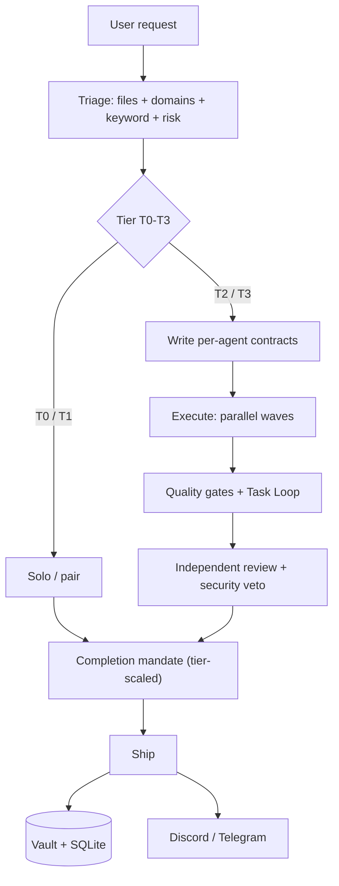
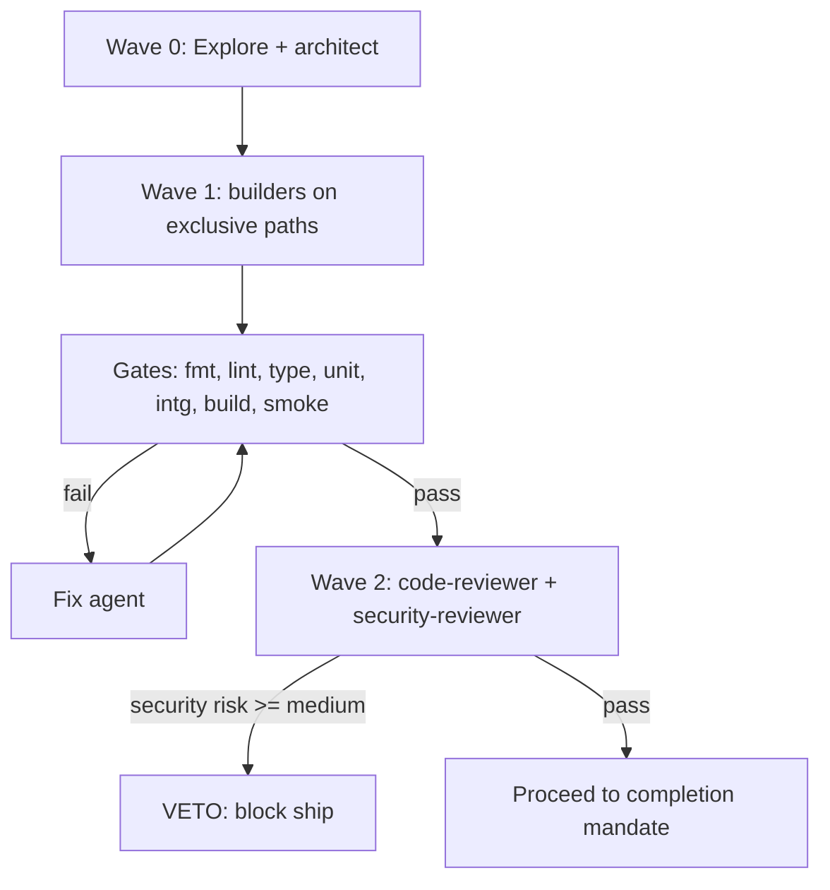
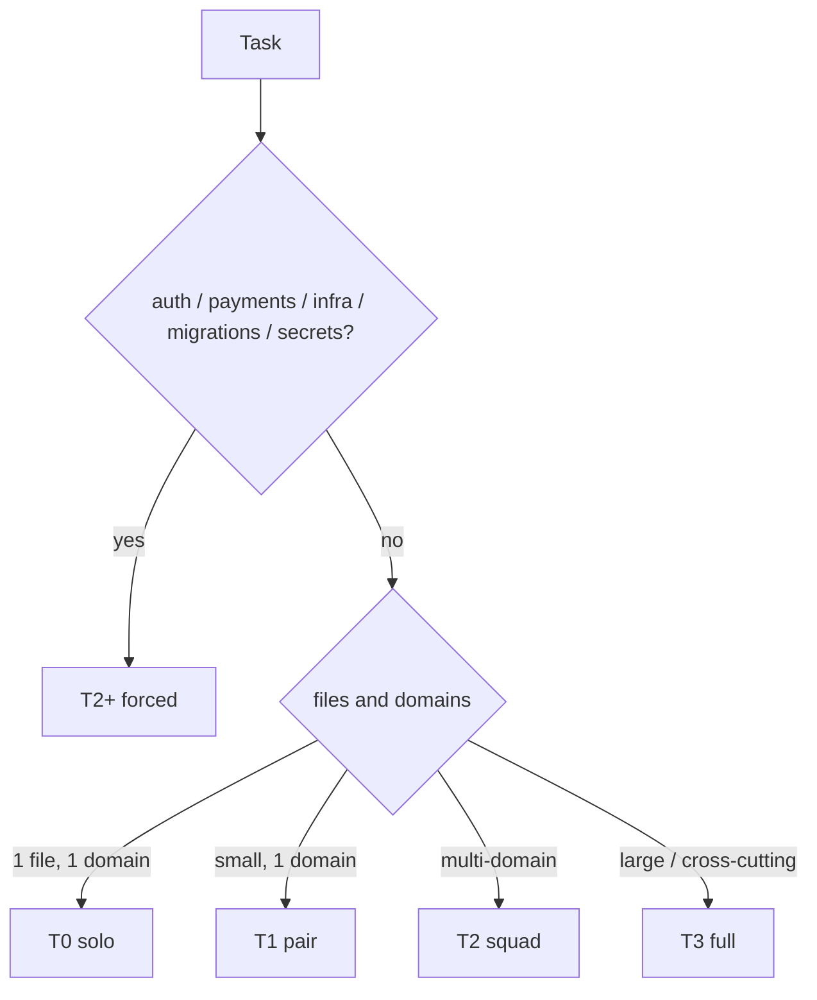
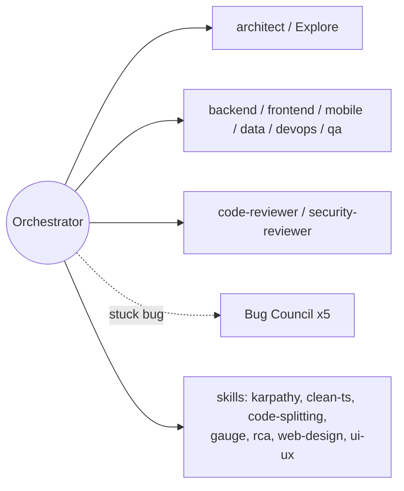
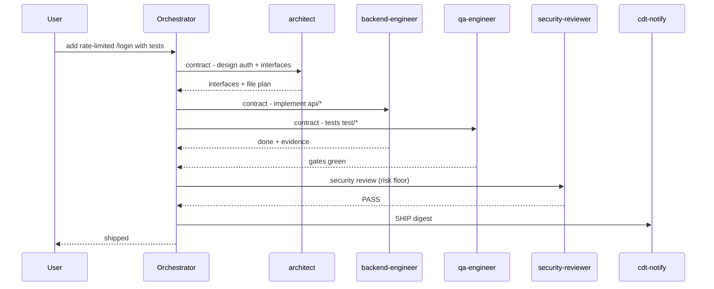
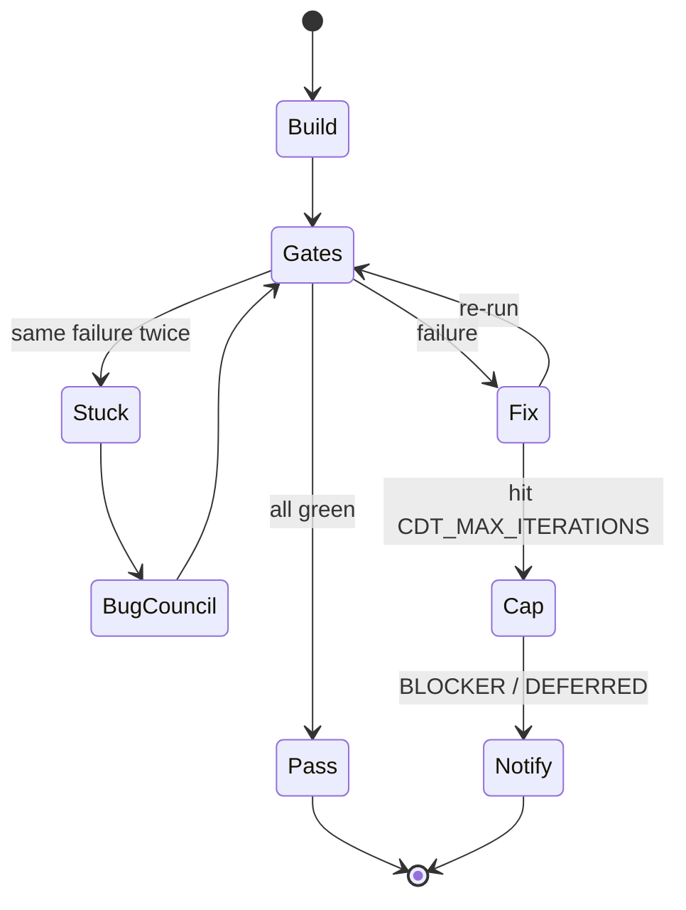
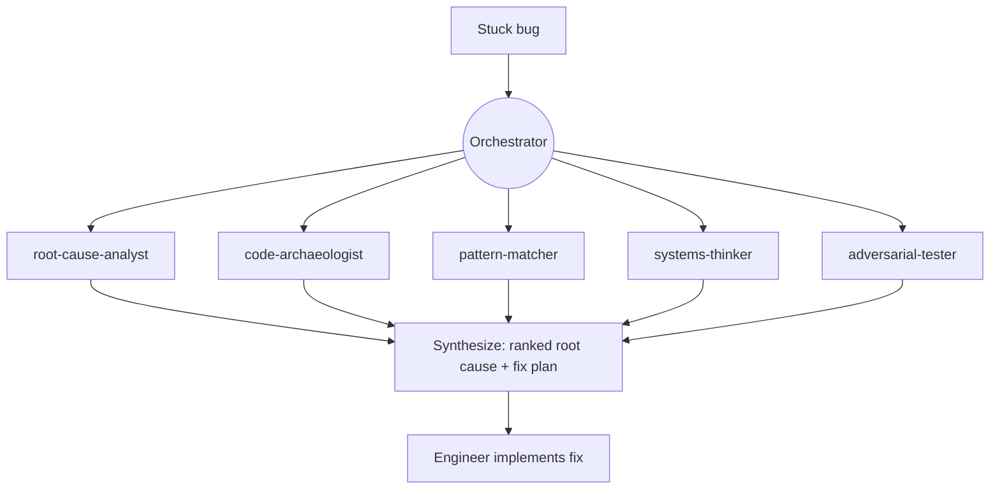

# claude-dev-team

> An orchestrated software team for Claude Code. One **tech-lead orchestrator** triages every request,
> writes per-agent **contracts**, dispatches **specialist subagents** in parallel, runs a **quality-gate
> chain**, gets **independent review**, then **ships** — and remembers what it learned.

   [](https://github.com/jaysonventura/claude-dev-team/actions/workflows/ci.yml)

It is built to be **cost-effective on Claude Max while staying high quality**: cheap work stays cheap
(most tasks need no team), and the expensive machinery only engages when complexity or risk demands it.

---

## ✨ What you get

- **Tiered triage (T0–T3)** — trivial edits run solo; features escalate to a parallel team.
- **Contract-driven dispatch** — every agent gets exclusive file ownership, a read-list, a verifiable
  done-condition, guardrails, and a ≤150-word structured report. (This is the anti-hallucination engine.)
- **10 role agents** + a gated **5-agent Bug Council** for stuck bugs.
- **9-gate quality chain** + a bounded **Task Loop** (iterate to green, anti-abandonment, capped, then
  notify).
- **Completion mandate** (tier-scaled) — simplify, review, reuse-audit, dead-code scan, learn, ship.
- **SQLite cost analytics** (`/stats`) so you can see and tune spend on Max.
- **Discord / Telegram notifications** for every milestone — delivered, deferred, blocker, ship.
- **A markdown vault** for durable memory (learnings, ADRs, session logs).
- **7 quality skills** (karpathy guidelines, clean TS, code-splitting, gauge-improvements, RCA, web
  design, ui/ux pro-max) plus first-class reuse of the official `superpowers`, `code-review`,
  `frontend-design`, `figma`, and `context7` plugins.

---

## Why

LLM coding fails in predictable ways: it hallucinates APIs, claims "done" without checking, sprawls a
simple change into ten files, and forgets yesterday's lesson. `claude-dev-team` is a **discipline layer**
that fixes those structurally — contracts force grounding, gates force verification, reviewers catch
mistakes, the vault remembers, and tiering keeps it all affordable.

---

## Architecture

How a request flows (Diagram A):



## Execution model

Parallel waves and the quality-gate chain (Diagram B):



## Triage & tiers

`complexity = files + domains + keyword + risk`. Anything touching **auth, payments, infra, migrations,
or secrets** is force-escalated to **T2+** and gets the full mandate (the *risk floor*).

| Tier | Name | Agents | When |
|------|------|--------|------|
| **T0** | solo | 0 | one file, one domain, no risk |
| **T1** | pair | 0–1 | small single-domain change |
| **T2** | squad | 3–5 | multi-domain, or any risk |
| **T3** | full | 6–10 | large / cross-cutting feature |

Tier decision (Diagram C):



**Overrides you can type:** `T0:` forces solo/cheap · `FULL:` forces full-Opus + all gates for critical
work (raises model + gates only — never effort or engine).

## The team

Orchestrator, specialists, and skills (Diagram D):



| Agent | Model | Role / file scope |
|-------|-------|-------------------|
| `architect` | Opus | design, interfaces, contracts (read-only) |
| `backend-engineer` | inherit | APIs, server, data access, logic (`api/server/*`) |
| `frontend-engineer` | inherit | web UI/components (`ui/client/*`) |
| `mobile-engineer` | inherit | RN/Expo/Flutter/native (`mobile/app/*`) |
| `qa-engineer` | inherit | tests + the gate chain (`test/*`) |
| `code-reviewer` | Opus | independent correctness/scope review (read-only) |
| `security-reviewer` | Opus | security review with **veto** (read-only) |
| `devops-engineer` | inherit | CI/CD, Docker, infra (`ci/* infra/*`) |
| `diagrams` | inherit | mermaid / figma visuals |
| `data-engineer` | inherit | schema, migrations, queries (`db/*`) |
| **Bug Council** (gated ×5) | inherit | root-cause-analyst · code-archaeologist · pattern-matcher · systems-thinker · adversarial-tester |

**Model routing is the core cost lever:** Opus reasons & reviews; Sonnet does the bulk typing. Run a
Sonnet session for routine work; `FULL:` or `/model opus` for critical work.

## Skills

| Skill | Use it for |
|-------|-----------|
| `orchestration` | the whole workflow (auto-triggers on dev tasks) |
| `karpathy-guidelines` | simplicity-first engineering bar |
| `clean-code-typescript` | strict, readable TS |
| `code-splitting` | file/module/bundle boundaries |
| `gauge-improvements` | prove a change is actually better |
| `root-cause-analysis` | debug to the cause, not the symptom |
| `web-design-guidelines` | UI fundamentals + a11y |
| `ui-ux-pro-max` | polish, motion, micro-interactions |

Reused official plugins: `superpowers`, `code-review`, `frontend-design`, `context7` — these
**auto-install as dependencies** when you install claude-dev-team (see Installation). `figma` is optional.

## Commands

| Command | Does |
|---------|------|
| `/triage <task>` | preview the tier + proposed dispatch **without** executing |
| `/ship` | run the completion mandate on the current work and ship |
| `/bug-council <symptom>` | convene the 5-agent diagnostic squad |
| `/stats [today\|week\|all]` | cost & activity report from the state DB |
| `/notify-setup [...]` | configure Discord/Telegram (no manual `.env`) |

---

## Installation

**Prerequisites:** Claude Code **≥ 2.1.110**; `git`; macOS/Linux; and the official marketplace
registered (it ships by default — if not, `claude plugin marketplace add anthropics/claude-plugins-official`).

**Install this plugin** — the companions (`superpowers`, `code-review`, `frontend-design`, `context7`)
**auto-install** as dependencies:
```
claude plugin marketplace add jaysonventura/claude-dev-team
claude plugin install claude-dev-team
```
Install **auto-enables** the plugin (and its companions) — no manual enable step.

**After install → just prompt (zero config).** Restart your Claude Code session (or `/reload-plugins`)
once so it loads. From then on, describe any task normally — the `orchestration` skill auto-triggers,
the SessionStart hook bootstraps `~/.claude/vault/` + the SQLite DB + the `~/.claude/bin/` CLIs, skills
auto-apply, and `/ship` `/triage` `/bug-council` `/stats` are available. Nothing else to set up.

- **Notifications are optional** — run `/notify-setup` only if you want Discord/Telegram pushes.
- **Power-user (guaranteed every session):** installers get orchestration via the auto-triggering skill
  + hook. For a hard always-on guarantee, drop the `orchestration` summary into your global
  `~/.claude/CLAUDE.md` (see `docs/architecture.md`). Most users don't need this.

---

## Notifications (Discord + Telegram)

Configure by **pasting** your webhook/token — never hand-edit `.env`:

```
/notify-setup discord https://discord.com/api/webhooks/XXX/YYY
# or, securely in your terminal (hidden input for tokens):
!cdt-setup
```

- **Discord:** Server Settings → Integrations → Webhooks → New Webhook → Copy URL.
- **Telegram:** message **@BotFather** → `/newbot` → copy token; message your bot once, then read your
  chat id from `https://api.telegram.org/bot<token>/getUpdates`.

Choose `CDT_NOTIFY_PROVIDER` = `discord` | `telegram` | `both` | `off`, and `CDT_NOTIFY_LEVEL` =
`all` | `milestones` | `off`. Credentials are stored in `~/.claude/claude-dev-team.env` at `chmod 600`
and are **never committed**. A posted message looks like: `✅ [DELIVERED] /login endpoint shipped: rate-limited, 12 tests green`.

---

## Usage examples

Just describe the task — the orchestrator triages and runs the right amount of process.

- **T0 — "fix this typo in the README"** → stays solo, edits, verifies, ships. One model call.
- **T2 — "add a rate-limited `/login` endpoint with tests"** → risk floor forces T2+: `architect`
  designs the interface, `backend-engineer` implements (`api/*`), `qa-engineer` writes tests (`test/*`),
  gates run, `security-reviewer` checks the auth path, then ship + a Discord post.
- **T3 — "build a settings page (web + mobile) with API + a migration"** → full team in parallel waves:
  architect → backend + frontend + mobile + data (exclusive paths) → gates + Task Loop → code + security
  review → ship + vault learning.

T2 example as a sequence (Diagram E):



---

## Autonomy & debugging

**Task Loop** — bounded autonomous quality enforcement (Diagram F):



**Bug Council** — convened only when stuck (Diagram G):



Anti-abandonment: agents must emit a structured `BLOCKER` rather than quit or fake success. The loop
stops after `CDT_MAX_ITERATIONS` (default 5) and notifies you — protecting your Max rate limits.

---

## State & cost analytics

A local SQLite DB (`~/.claude/claude-dev-team.db`) records `sessions`, `tasks`, `agent_runs`, `events`,
and `usage`. Run `/stats` (or `cdt-stats today|week|all`) for activity by tier/agent, iteration counts,
and blocker rate. Activity/timing is precise; **token cost is a best-effort estimate** derived from
Claude Code's own usage data and is labeled as such.

## Configuration

| Setting | Default | Meaning |
|---------|---------|---------|
| session model | your choice | Sonnet = cheap throughput; Opus = max power |
| `FULL:` / `T0:` prefixes | — | up/down-throttle a single request |
| `CDT_MAX_ITERATIONS` | 5 | Task Loop hard cap |
| `CDT_NOTIFY_PROVIDER` | off | `discord` / `telegram` / `both` / `off` |
| `CDT_NOTIFY_LEVEL` | milestones | `all` / `milestones` / `off` |
| `CDT_STOP_REMINDER` | 0 | `1` = remind once to run the mandate at session end |

Effort runs at your session level and the orchestration never uses heavy multi-agent fan-out engines —
it dispatches a bounded set of subagents per tier. Pin any agent's `model:` in `agents/*.md` to taste.

## How to review / audit

Everything is plain files. Check: agents honoring exclusive scope (the diffs), gates actually run
(pasted output in reports), `~/.claude/vault/` session notes + learnings, `status-log.md`, and the DB
(`/stats`). To uninstall, `claude plugin uninstall claude-dev-team` and remove the orchestration block
from `~/.claude/CLAUDE.md` — you're back to stock Claude Code.

## Project layout

```
.claude-plugin/   plugin.json, marketplace.json
agents/           10 core role agents + 5 Bug Council agents (flat)
skills/           orchestration (brain) + 7 quality skills
commands/         ship, triage, bug-council, stats, notify-setup
hooks/            hooks.json + scripts (vault/db/format/notify/setup/stats/guard) + vault-template
docs/             architecture.md, examples.md
```

## Roadmap & contributing

More agents (`pm`, `technical-writer`, `ml-engineer`); a measured roster expansion (SRE, accessibility,
performance auditor); media/writing skills; an opt-in Eco mode; richer cost attribution. To add an
agent, drop a markdown file in `agents/`; to add a skill, a folder + `SKILL.md` in `skills/`. PRs welcome.

## License

MIT © 2026 Jayson Ventura.
