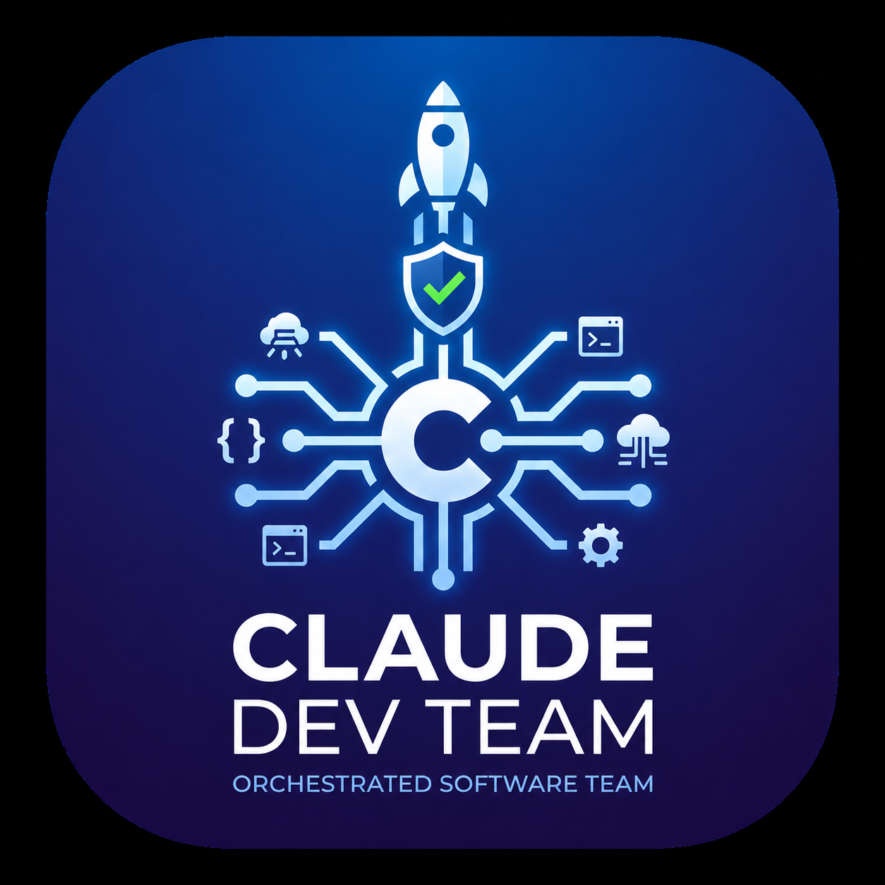
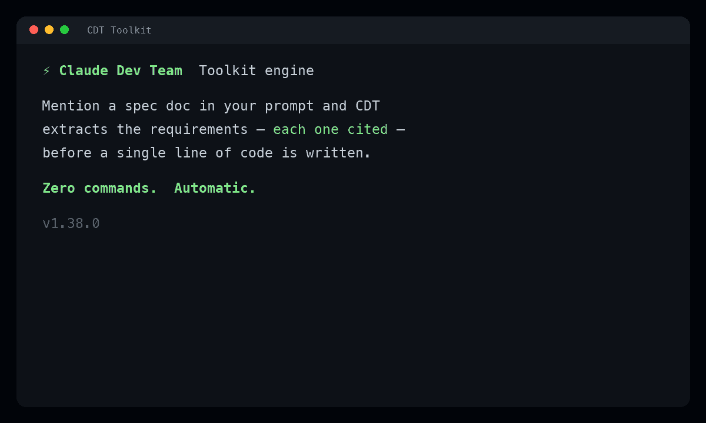
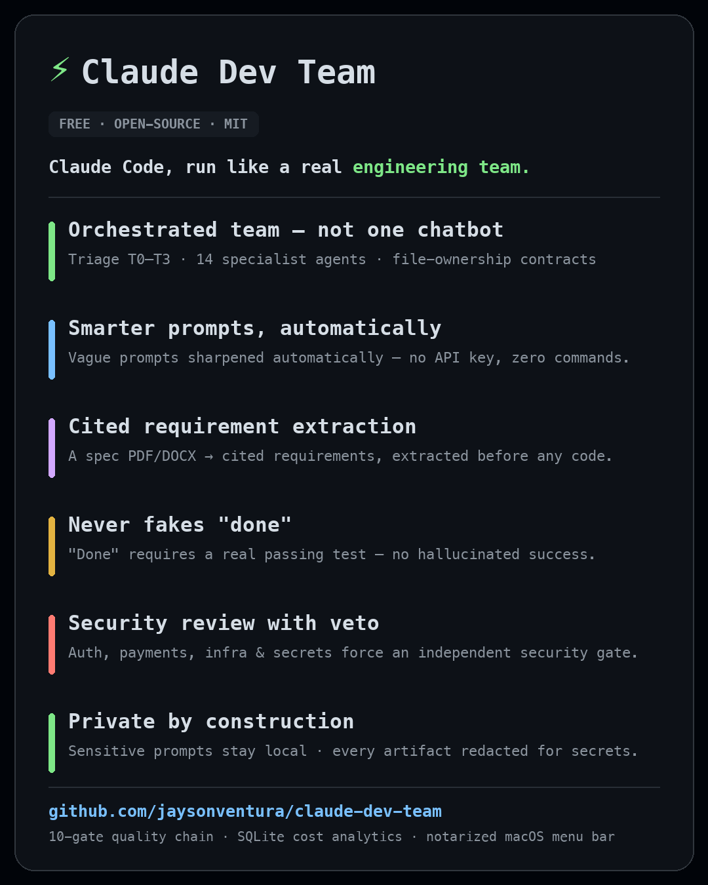
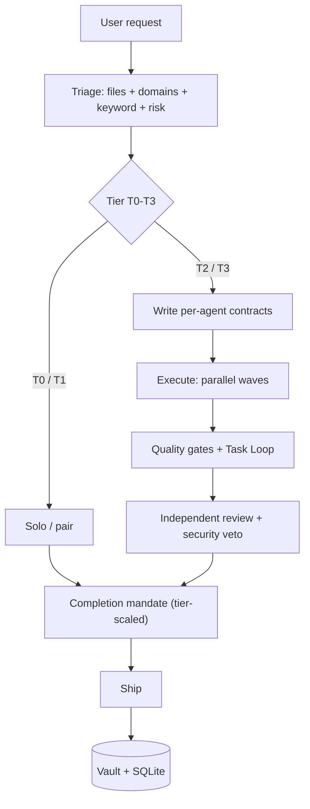
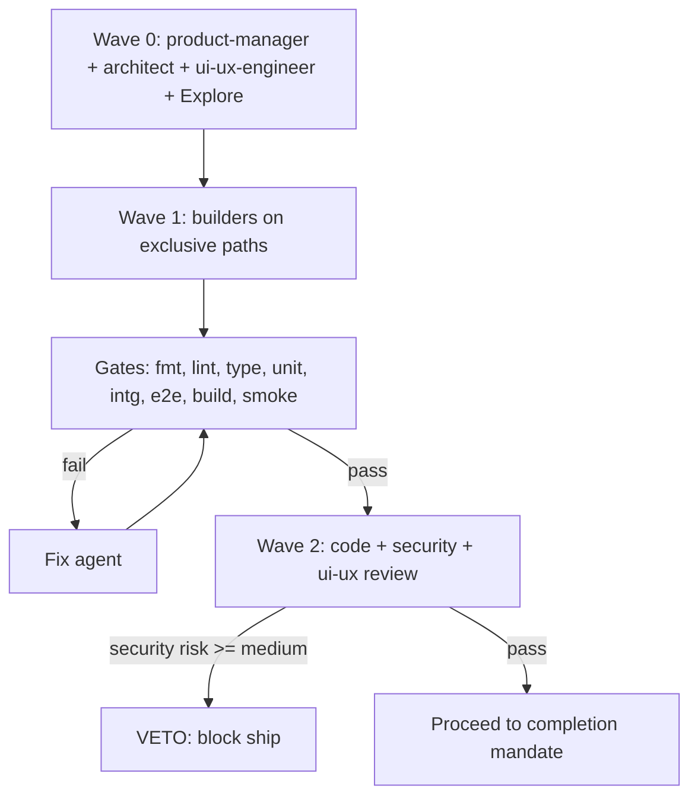
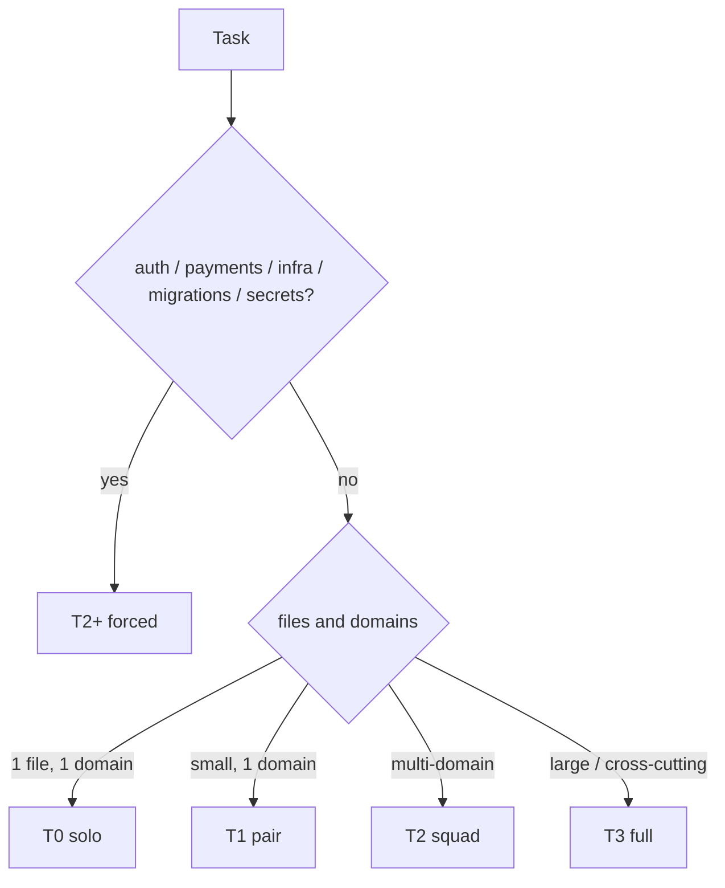
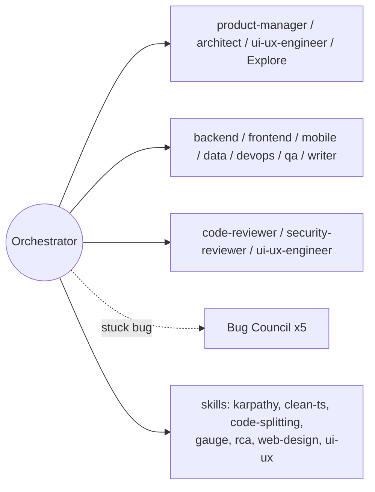
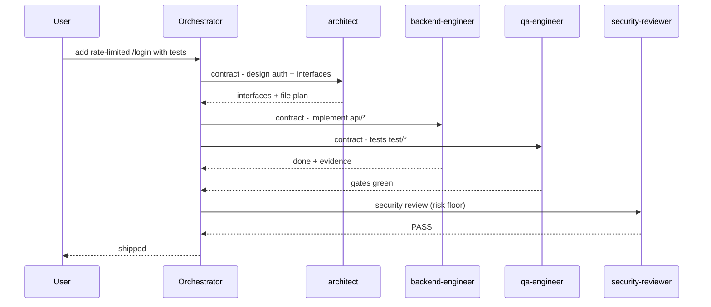
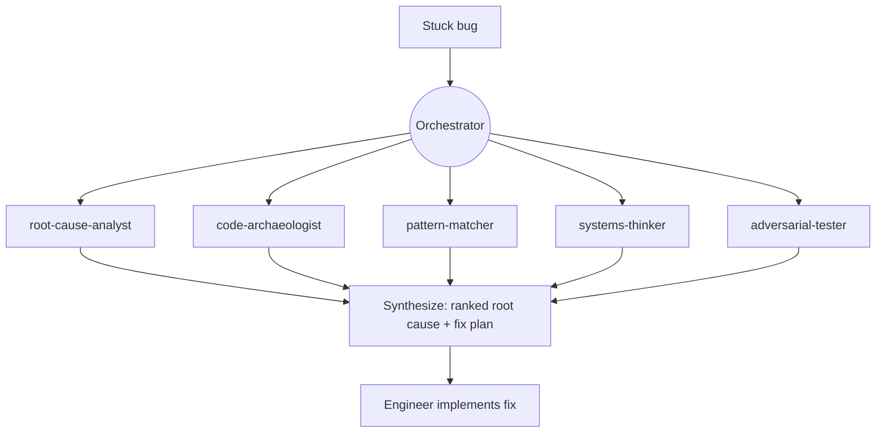
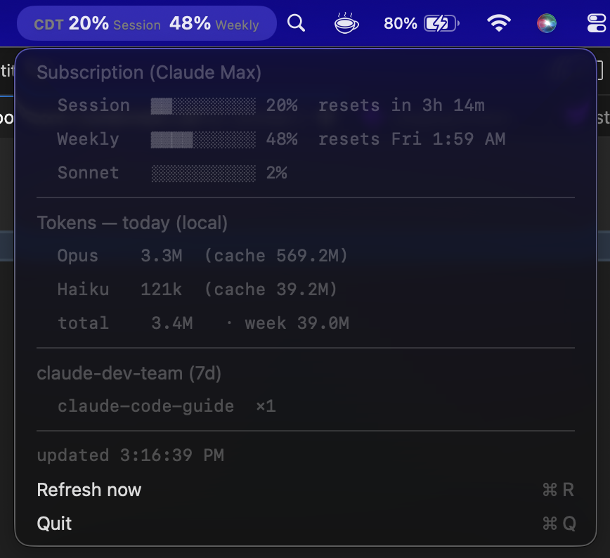

<p align="center">
  
</p>

# claude-dev-team

> An orchestrated software team for Claude Code. One **tech-lead orchestrator** triages every request,
> writes per-agent **contracts**, dispatches **specialist subagents** in parallel, runs a **quality-gate
> chain**, gets **independent review**, then **ships** — and remembers what it learned.

   [](https://github.com/jaysonventura/claude-dev-team/actions/workflows/ci.yml) [](CONTRIBUTING.md)

It is built to be **cost-effective on Claude Max while staying high quality**: cheap work stays cheap
(most tasks need no team), and the expensive machinery only engages when complexity or risk demands it.

<p align="center">
  
  <br><em>Mention a spec doc and CDT extracts the requirements — each cited — before any code. Zero commands.</em>
</p>
<p align="center">
  
</p>

---

## Contents

<details>
<summary>Jump to a section</summary>

- [What you get](#what-you-get) · [Why](#why)
- [Architecture](#architecture) · [Execution model](#execution-model) · [Triage & tiers](#triage--tiers)
- [The team](#the-team) · [Skills](#skills) · [Commands](#commands)
- [Installation](#installation) · [Requirements](#requirements)
- [Usage examples](#usage-examples) · [Autonomy & debugging](#autonomy--debugging)
- [Parallel isolation (git worktrees)](#parallel-isolation-git-worktrees) · [Autonomous orchestration](#autonomous-orchestration-router--cost-governor)
- [State & cost analytics](#state--cost-analytics) · [Memory & recall](#memory--recall)
- [Menu bar usage monitor (macOS)](#menu-bar-usage-monitor-macos) · [Configuration](#configuration)
- [Security & privacy](#security--privacy) · [Troubleshooting](#troubleshooting) · [How to review / audit](#how-to-review--audit)
- [Uninstall](#uninstall) · [Project layout](#project-layout) · [Roadmap & contributing](#roadmap--contributing) · [License](#license)

</details>

---

## What you get

- **Tiered triage (T0–T3)** — trivial edits run solo; features escalate to a parallel team.
- **Autonomous orchestration** — a mode router + cost governor that, only when the work warrants it,
  escalates to a *debating* **agent-team** (depth) or a *fan-out* **dynamic workflow** (breadth) —
  gated, capped, and budget-aware so it stays cheap on Max. Off by default; opt in per engine.
- **Parallel isolation (git worktrees)** — `cdt-worktree` gives each parallel strand its own
  checkout+branch (interops with `claude --worktree`) for collision-free big features.
- **Contract-driven dispatch** — every agent gets exclusive file ownership, a read-list, a verifiable
  done-condition, guardrails, and a ≤150-word structured report. (This is the anti-hallucination engine.)
- **Grounded builders (code-backed)** — the engineering builders (backend / frontend / mobile / data /
  devops / qa) natively carry the **context7** doc tools, so "look it up, don't guess the API" is
  actually possible; `lint-agents.sh` fails CI if a builder ever loses them.
- **Automation-first (no improvised deploys)** — agents prefer existing repo automation over hand-written
  commands: **explicit user command > Makefile > package/composer scripts > `scripts/` > docs/CI >
  manual**. Dev deploy/build → `make up-dev`; on a Makefile-target failure they **stop and report**
  instead of improvising another path. Reviewers + QA **flag** manual `serverless`/`gradle`/`npm`·`ng
  build`/`cap sync`/AWS deploy commands when an equivalent target/script exists. (`automation-first` skill)
- **Deterministic-first toolkit engine (TypeScript)** — **runs on every prompt, zero commands:** sharpens your
  prompt (conditional Haiku via your existing login — **no API key**; sensitive/trivial prompts never leave the
  machine), routes it, **auto-extracts** a spec doc you mention (`cdt-spec`, **cited sources**, source/folders
  excluded), and refuses to fake "done" (**evidence-only** `cdt-verify`). Mandatory **redaction** + a
  `realpath()` **write-jail**; toggle it independently of core CDT.
  See **[Toolkit engine](#toolkit-engine--your-prompts-get-smarter-automatically)**.
- **14 role agents** (product-manager → architect → ui-ux-engineer → builders → technical-writer →
  reviewers, incl. a Haiku `fast-ops` tier) + a gated **5-agent Bug Council** for stuck bugs.
- **10-gate quality chain** (incl. **e2e** for user-facing flows) + a bounded **Task Loop** (iterate to
  green, anti-abandonment, capped).
- **Completion mandate** (tier-scaled) — simplify, review, reuse-audit, dead-code scan, learn, ship.
- **SQLite cost analytics** with **real per-agent token telemetry** (`/cdt:stats` ranks which roles
  cost the most) so you can see and tune spend on Max.
- **A markdown vault** for durable memory (learnings, ADRs, session logs).
- **8 quality skills** (karpathy guidelines, clean TS, code-splitting, gauge-improvements, RCA, web
  design, ui/ux pro-max, technical-writing) plus first-class reuse of the official `superpowers`, `code-review`,
  `frontend-design`, `figma`, and `context7` plugins.

---

## Why

LLM coding fails in predictable ways: it hallucinates APIs, claims "done" without checking, sprawls a
simple change into ten files, and forgets yesterday's lesson. `claude-dev-team` is a **discipline layer**
that fixes those structurally — contracts force grounding, gates force verification, reviewers catch
mistakes, the vault remembers, and tiering keeps it all affordable.

### Enforcement — code-backed, not just instructed

Those four failure modes are caught by **hooks and CI**, so the discipline holds even when the model
would rather skip it. Each gate is **default-on but configurable**, fires **once per session**, and is
**fail-open** (a missing `python3`/marker never breaks or blocks your session):

| Predictable failure | Code-backed enforcement | Tune |
|---|---|---|
| Claims "done" without checking | **Verify gate** — a `Stop` hook blocks a session that edited files but ran no test/build/lint/typecheck afterward (subagent test runs count). | `cdt-config verify block\|warn\|off` |
| Hallucinates APIs | **Grounding** — builder agents carry the `context7` doc tools; `lint-agents.sh` fails CI if one loses them. | always on (CI-enforced) |
| Sprawls a change into ten files | **Scope gate** — `SubagentStop` diffs what each agent actually wrote against its exclusive-file contract; flags overreach/collisions. | `cdt-config scope warn\|block\|off` |
| Forgets yesterday's lesson | **Memory gate** — a team-tier session that edits but records no vault lesson is nudged; `cdt-recall` ranks by recency + outcome. | `cdt-config memory warn\|block\|off` |
| Blind expensive fan-out | **Cost governor** — escalation is budget-gated; BREADTH is **slice-first** (measure a slice, project the full cost vs the cap before fanning out); per-agent + orchestrator-overhead telemetry. | `cdt-auto`, `cdt-config eco` |

**Honest scope:** the gates *detect, surface, and block* — they don't author the work. The orchestrator
still has to write the contracts, pick the right tier, run the independent review, and emit each agent's
`CDT-CONTRACT:` line; those remain model-driven (the strong-Opus bet), with the hooks as the backstop.
Design notes: [`docs/specs/2026-06-16-enforcement-gates.md`](docs/specs/2026-06-16-enforcement-gates.md).

---

## Architecture

How a request flows (Diagram A):



## Execution model

Parallel waves and the quality-gate chain (Diagram B):



## Triage & tiers

`complexity = files + domains + keyword + risk`. Anything touching **auth, payments, infra, migrations,
or secrets** is force-escalated to **T2+** and gets the full mandate (the *risk floor*).

| Tier | Name | Agents | When |
|------|------|--------|------|
| **T0** | solo | 0 | one file, one domain, no risk |
| **T1** | pair | 0–1 | small single-domain change |
| **T2** | squad | 3–5 | multi-domain, or any risk |
| **T3** | full | 6–10 | large / cross-cutting feature |

Tier decision (Diagram C):



**Overrides you can type:** `T0:` forces solo/cheap · `FULL:` forces full-Opus + all gates for critical
work (raises model + gates only — never effort or engine).

## The team

Orchestrator, specialists, and skills (Diagram D):



| Agent | Model | Role / file scope |
|-------|-------|-------------------|
| `product-manager` | Opus | requirements + testable acceptance criteria + scope/non-goals (read-only, Wave 0) |
| `architect` | Opus | design, interfaces, contracts (read-only) |
| `backend-engineer` | inherit | APIs, server, data access, logic (`api/server/*`) |
| `frontend-engineer` | inherit | web UI/components (`ui/client/*`) |
| `mobile-engineer` | inherit | RN/Expo/Flutter/native (`mobile/app/*`) |
| `ui-ux-engineer` | Opus | UX flows, design system/tokens, accessibility + visual-polish review (`design/*`) |
| `qa-engineer` | inherit | tests + the gate chain (`test/*`) |
| `code-reviewer` | Opus | independent correctness/scope review (read-only) |
| `security-reviewer` | Opus | security review with **veto** (read-only) |
| `devops-engineer` | inherit | CI/CD, Docker, infra (`ci/* infra/*`) |
| `diagrams` | inherit | mermaid / figma visuals |
| `data-engineer` | inherit | schema, migrations, queries (`db/*`) |
| `technical-writer` | inherit | user-facing docs — README/guides/release notes/ADRs (`docs/*` prose) |
| **Bug Council** (gated ×5) | inherit | root-cause-analyst · code-archaeologist · pattern-matcher · systems-thinker · adversarial-tester |
| `fast-ops` | **Haiku** | the cheap "hands" tier — trivial mechanical ops **only** (gather, literal find/replace, rename, template fill); **never** dev/test/review/security |

**Model routing — Opus is the recommended main model.** Quality-critical work runs on a strong model;
cost-effectiveness comes from **tiering + a trivial-only low tier**, never from downgrading important
work. **Opus** reasons & reviews (product, architecture, UX, code & security) and is the right session model for
quality work; **Sonnet** (inherit) is a capable high-quality tier fine for routine throughput; **Haiku**
(`fast-ops`) is the **low tier for *trivial mechanical* ops only** — it **never** touches complicated or
quality-sensitive work (orchestration, development, testing, review, security) and escalates the instant
a task needs judgment. Run Sonnet for routine work; **Opus** (or `FULL:`) for anything that matters.

## Skills

| Skill | Use it for |
|-------|-----------|
| `orchestration` | the whole workflow (auto-triggers on dev tasks) |
| `karpathy-guidelines` | simplicity-first engineering bar |
| `clean-code-typescript` | strict, readable TS |
| `code-splitting` | file/module/bundle boundaries |
| `gauge-improvements` | prove a change is actually better |
| `root-cause-analysis` | debug to the cause, not the symptom |
| `web-design-guidelines` | UI fundamentals + a11y |
| `ui-ux-pro-max` | polish, motion, micro-interactions |
| `technical-writing` | accurate, scannable, current docs — READMEs, guides, release notes, ADRs |

Reused official plugins: `superpowers`, `code-review`, `frontend-design`, `context7` — these
**auto-install as dependencies** when you install claude-dev-team (see Installation). `figma` is optional.

## Commands

Plugin commands are **namespaced** — invoke them as `/cdt:<command>` (auto-loaded in a fresh
session; the bare `/command` form won't match).

| Command | Does |
|---------|------|
| `/cdt:triage <task>` | preview the tier + proposed dispatch **without** executing |
| `/cdt:prompt "<task>"` | toolkit: prompt intake + routing + conditional enhancement → `.claude/{TASK_BRIEF,ROUTING,NEXT_PROMPT}` (also auto-runs on every non-trivial prompt) |
| `/cdt:spec <files…>` | toolkit: deterministic requirement/spec extraction → `.claude/specs/*` with cited sources |
| `/cdt:ship` | run the completion mandate on the current work and ship |
| `/cdt:bug-council <symptom>` | convene the 5-agent diagnostic squad |
| `/cdt:autopilot <PR#> [--live]` | drive a GitHub PR toward green — CI fixes, conflicts, review (dry-run by default) |
| `/cdt:stats [today\|week\|all]` | cost & activity report from the state DB — incl. **which agents cost the most tokens** |
| `/cdt:recall <task>` | recall the most relevant past lessons from the vault for a task |
| `/cdt:advise <task>` | advisory tier/effort prior learned from how similar past tasks went |
| `/cdt:config [...]` | enable/disable CDT **+ the toolkit** + set defaults (effort, model, eco, statusline, `prompt-mode`, `redact`, …); defaults xhigh + Opus 4.8 |
| `/cdt:doctor` | health-check the install (hooks, CLIs, DB, gh, menu bar, deps) |
| `/cdt:deps [--install]` | check / install system prerequisites (python3, git, curl, sqlite3, gh) |
| `/cdt:worktree [new\|list\|rm\|...]` | git-worktree isolation for parallel work (interops with `claude --worktree`) |
| `/cdt:auto [status\|gate\|explain\|off\|assist\|auto]` | the autonomous mode router + cost governor (BOUNDED / DEPTH / BREADTH) |
| `/cdt:budget` | show usage % + the Eco (conserve-when-low) recommendation |
| `/cdt:learn <lesson>` | teach the vault a durable lesson (surfaced later by recall) |
| `/cdt:menubar [install\|status\|...]` | macOS menu bar usage monitor (subscription % + local tokens) |
| `/cdt:version` | show the installed version (plugin + menu bar app) |

---

## Toolkit engine — your prompts get smarter, automatically

A deterministic-first TypeScript engine (under `toolkit/`) that **runs on every prompt — no commands to
remember.** You just type; CDT quietly sharpens the prompt, routes it, pulls in any spec you mention, and
keeps "done" honest. Everything stays **on your machine** (`.claude/`) — nothing is sent anywhere,
**no API key** (it uses your existing Claude login).

### What happens the moment you hit Enter

```text
You type:  "improve the checkout flow and use requirements.pdf"
              │
              ▼   AUTOMATIC — the toolkit (deterministic, with a touch of Haiku)
   • routes it → tier, model, which specialists, security review?   → ROUTING.json
   • sharpens a vague/risky prompt with Haiku (your login, no key)   → a *suggestion*, never a rewrite
   • spots "requirements.pdf", extracts cited requirements           → .claude/specs/
   • redacts every secret before anything is written to disk
              │
              ▼   THE WORK — the Orchestrator (the model @ xhigh, the tech-lead)
   triage → write per-agent contracts → dispatch specialist agents in parallel
          → quality gates → independent + security review → ship
              │
              ▼   HONESTY BACKSTOP — hooks
   "done" is blocked without a real passing command · cdt-verify records the proof
```

> **The toolkit preps & guards (automatic, advisory). The Orchestrator decides & ships (it does the real
> engineering).** Routing is *advisory* — `advisory: true`, never auto-dispatch. The toolkit can't build your
> feature; the orchestrator can — the toolkit just hands it a cleaner brief and refuses to let it fake "done."

### The pieces (all auto-run — or invoke them yourself)

| Tool | What it does for you |
|------|----------------------|
| **`cdt-prompt`** | Fires on **every non-trivial prompt** (UserPromptSubmit hook): intake → routing → *conditional* Haiku enhancement → `.claude/{TASK_BRIEF, ROUTING, NEXT_PROMPT}`. `/cdt:prompt` is just the manual button. |
| **`cdt-spec`** | Turns a **PDF/DOCX/MD** into a clean requirement list — **one cited source per requirement, never hallucinated.** With `CDT_SPEC_AUTO=true` it **auto-detects** a spec doc named in your prompt (and ignores source files & folders). |
| **`cdt-verify -- <cmd>`** | The **only** way `verification: passed` is earned — runs your real test/build and captures the actual exit code. No more "it works" without proof. |
| **`cdt enable｜disable`** · **`cdt status`** · **`cdt init`** | Toggle the toolkit (separately from core CDT), check state, scaffold a project. |

### Why it's safe — by construction, not by promise

- 🔒 **Your secrets never leave the machine.** A *fail-closed* sensitivity gate sends sensitive prompts/docs
  to **no** external model; every artifact is **redacted** (the raw prompt isn't even stored — only a
  redacted copy + an HMAC hash).
- ✅ **No fake "done."** `verification` comes only from a real command's exit code.
- 📄 **No hallucinated requirements.** `cdt-spec` copies + cites; it never invents — and its auto-detect
  **classifies every path first**, so `.ts`/`.py` source files, project **folders**, missing paths, and URLs
  are excluded; only a real `.pdf`/`.docx` (or requirement-named `.md`) is treated as a spec.
- 🧱 **Can't write outside `.claude/`** (realpath write-jail); validators **safe-degrade** instead of
  crashing; a docs-only edit never trips the verify gate.

### Controls (CLI or the macOS menu bar)

```sh
cdt enable | cdt disable                   # the whole toolkit, separate from core CDT (cdt-config on|off)
cdt-config prompt-mode auto|always|off     # when Haiku fires (auto = only unclear/risky prompts)
cdt-config prompt-effort medium|high       # the enhancer's effort (Haiku) — your real work stays xhigh
cdt-config spec-auto on|off                # auto-extract a spec doc named in your prompt (default off)
cdt-config redact on|off                   # mask secrets/PII in artifacts (default on — keep it)
```

On macOS the **menu bar** has the same toggles (Enabled / Toolkit engine / Prompt enhance), shows your live
usage %, and **auto-rebuilds itself** when you update the plugin.

_Builds on first session (`cd toolkit && npm install && npm run build`). Config precedence: packaged defaults
< global `~/.claude/claude-dev-team.env` < project `.claude/cdt.config.json` < env._

---

## Installation

### Requirements

**Claude Code ≥ 2.1.143** (so dependencies auto-*enable*, not just install; on 2.1.110–2.1.142 the
companions install but you may need to enable them once). The official marketplace must be registered (it
ships by default — else `claude plugin marketplace add anthropics/claude-plugins-official`).

**System tools** — run **`~/.claude/bin/cdt-deps`** to check what's present, **`cdt-deps --install`** to
install the missing ones via your package manager:

| Tool | Required? | Used for | macOS | Debian/Ubuntu | Windows |
|------|-----------|----------|-------|---------------|---------|
| **python3** | **required** | recall, advise, config, status line, analytics | `brew install python3` | `apt install python3` | python.org · `winget install Python.Python.3.12` |
| **git** | **required** | install, autopilot, version ops | `brew install git` | `apt install git` | gitforwindows.org · `winget install Git.Git` |
| **bash** | **required** | runs the hooks & `cdt-*` CLIs | preinstalled | preinstalled | **Git for Windows** (Git Bash) |
| **sqlite3** (CLI) | optional | analytics CLI — *python3 fallback exists* | `brew install sqlite` | `apt install sqlite3` | `winget install SQLite.SQLite` |
| **gh** | optional | PR autopilot | `brew install gh` | `apt install gh` | `winget install GitHub.cli` |
| **swift** (Xcode) | optional | the macOS menu bar app only | `xcode-select --install` | — | — |

**No Python packages to install** — every script uses the **python3 standard library only** (`json`,
`sqlite3`, `re`, …). There is no `pip install` step.

**Companion plugins auto-install** with claude-dev-team (declared as manifest `dependencies`):
`superpowers`, `code-review`, `frontend-design`, `context7` (`figma` is optional).

**Platforms:** macOS · Linux · **Windows** — each has a step-by-step guide in
[Step 2 — Set up your platform](#step-2--set-up-your-platform) below. The **menu bar is macOS-only**;
elsewhere use the cross-platform status line.

### Step 1 — Install the plugin (all platforms)

```
claude plugin marketplace add jaysonventura/claude-dev-team
claude plugin install cdt@claude-dev-team
```

> The repo / marketplace is **`claude-dev-team`** (the project); the plugin installs as **`cdt`**, so its
> commands are short — **`/cdt:ship`**, **`/cdt:doctor`**, … (matching the `cdt-*` CLIs).

Install **auto-enables** the plugin and its companions (`superpowers`, `code-review`, `frontend-design`,
`context7`) — no manual enable step. It's a **user-scope** install in `~/.claude/`, shared across every
Claude Code surface on this machine (the CLI, the VS Code & JetBrains extensions, and the desktop app).
*(Non–Claude-Code tools like Google Antigravity run a different engine and won't load it.)*

### Step 2 — Set up your platform

Follow the guide for your OS, then run **`/cdt:doctor`** — it verifies hooks, CLIs, the DB, `gh`, the
menu bar, and companion plugins, and prints a fix for anything not green.

<details open>
<summary><b>🍎 macOS</b></summary>

1. **Install the system tools** (or run `~/.claude/bin/cdt-deps --install` to do it for you):
   ```
   brew install python3 git          # required · gh + sqlite are optional
   ```
2. **Restart your Claude Code session** (or run `/reload-plugins`) so the plugin loads.
3. **Menu bar app** — it builds + installs automatically on your first session (look for the **CDT** item
   showing your session/weekly %). It needs the Swift toolchain — if it doesn't appear, run
   `xcode-select --install`, or grab the **notarized DMG** from the [Releases](https://github.com/jaysonventura/claude-dev-team/releases) page. Manage it with `/cdt:menubar`.
4. **Verify:** `/cdt:doctor` → all green. Done — just describe a task.

</details>

<details>
<summary><b>🪟 Windows</b></summary>

Claude Code runs the plugin's `.sh` hooks through **Git Bash**, so:

1. **Install [Git for Windows](https://gitforwindows.org/)** (provides Bash) and
   **[Python 3](https://www.python.org/downloads/)** — tick *"Add Python to PATH"* during setup.
2. **If you also have WSL,** pin Git Bash so hooks don't resolve to WSL's `bash.exe`. Add to
   `%USERPROFILE%\.claude\settings.json`:
   ```json
   { "env": { "CLAUDE_CODE_GIT_BASH_PATH": "C:\\Program Files\\Git\\bin\\bash.exe" } }
   ```
3. **Restart your Claude Code session** (or `/reload-plugins`).
4. **Usage display** — the menu bar is macOS-only; turn on the cross-platform **status line** instead:
   ```
   ~/.claude/bin/cdt-config statusline on
   ```
5. **Verify:** `/cdt:doctor` → all green. *(Shell scripts ship with LF line endings via `.gitattributes`,
   so Git's autocrlf can't break them.)*

</details>

<details>
<summary><b>🐧 Linux</b></summary>

Bash + Python 3 are standard, so it works out of the box:

1. Make sure `python3` and `git` are installed (`~/.claude/bin/cdt-deps --install` adds any missing via
   apt / dnf / pacman / zypper).
2. **Restart your Claude Code session.**
3. **Usage display** — the menu bar is macOS-only; use the status line: `cdt-config statusline on`.
4. **Verify:** `/cdt:doctor` → all green.

</details>

### After install → just prompt (zero config)

Describe any task normally. The `orchestration` skill auto-triggers, the SessionStart hook bootstraps the
vault + SQLite DB + `cdt-*` CLIs, skills auto-apply, and the `/cdt:*` commands are available.

- **Always-on (power users):** for a hard guarantee every session, drop the `orchestration` summary into
  your global `~/.claude/CLAUDE.md` (see [`docs/architecture.md`](docs/architecture.md)). Most users don't need this.

### Updating CDT (get the latest version)

CDT is tracked from `main`, so updating is two commands + a restart:

```
claude plugin marketplace update claude-dev-team   # refresh the marketplace from the repo
claude plugin update cdt@claude-dev-team           # update the plugin (restart required to apply)
```

Then **restart your Claude Code session** (or `/reload-plugins`). Check your version with
`claude plugin list` or **`/cdt:version`** — it also flags the macOS menu-bar app when it lags the plugin.

**macOS menu-bar app** — the plugin update ships the new app *source*; refresh the running app one of two ways:
- **Re-run `/cdt:menubar`** — rebuilds & relaunches `CDT Usage.app` from the updated source (needs the Swift toolchain), **or**
- **Download the notarized DMG** from the **[latest release](https://github.com/jaysonventura/claude-dev-team/releases/latest)**, drag `CDT Usage` to Applications, and open it (notarized — no Gatekeeper warnings).

Releases follow semver; the **[CHANGELOG](CHANGELOG.md)** lists every version. Latest: **v1.42.0**.

---

## Usage examples

Just describe the task — the orchestrator triages and runs the right amount of process.

- **T0 — "fix this typo in the README"** → stays solo, edits, verifies, ships. One model call.
- **T2 — "add a rate-limited `/login` endpoint with tests"** → risk floor forces T2+: `architect`
  designs the interface, `backend-engineer` implements (`api/*`), `qa-engineer` writes tests (`test/*`),
  gates run, `security-reviewer` checks the auth path, then ship.
- **T3 — "build a settings page (web + mobile) with API + a migration"** → full team in parallel waves:
  architect → backend + frontend + mobile + data (exclusive paths) → gates + Task Loop → code + security
  review → ship + vault learning.

T2 example as a sequence (Diagram E):



---

## Autonomy & debugging

**Task Loop** — bounded autonomous quality enforcement (Diagram F):


**Bug Council** — convened only when stuck (Diagram G):



Anti-abandonment: agents must emit a structured `BLOCKER` rather than quit or fake success. The loop
stops after `CDT_MAX_ITERATIONS` (default 5) and reports what's left — protecting your Max rate limits.

> **DEPTH upgrade.** With agent teams enabled (`cdt-config teams on`), the Council convenes as a
> *debating* **agent-team** — a shared task list + mailbox so the five lenses challenge each other before
> a verdict, instead of five parallel monologues. It's gated by the cost governor (`cdt-auto gate team`)
> and falls back to parallel subagents when teams are off. See
> [Autonomous orchestration](#autonomous-orchestration-router--cost-governor).

**PR autopilot (opt-in).** `/cdt:autopilot <PR#>` drives a real GitHub PR toward green: read
CI status → diagnose + dispatch a focused fix → push to the branch → re-check → and, once green, post a
`code-reviewer` + `security-reviewer` synthesis as a PR comment. It's deliberately **safe**: **dry-run by
default** (add `--live` to act), **never force-pushes, never auto-merges, never closes** — merging stays
your explicit call. Bounded by `CDT_MAX_ITERATIONS`, reports each step to you. Needs `gh`
authenticated. Uses a read-mostly wrapper (`cdt-pr`) whose only write is posting a comment.

---

## Parallel isolation (git worktrees) + budget-elastic fan-out

For **parallel multi-writer waves** — several features at once, or each builder in a T2+/T3 wave —
CDT turns its *disjoint-paths* convention into a **hard filesystem guarantee** with git worktrees: each
strand gets its own checkout + branch, so even shared-file edits can't collide and strands run truly in
parallel (faster shipping). This is **on by default** when ≥2 agents write concurrently
(`CDT_WORKTREE_DEFAULT=0` to force in-place; single-writer waves and T0/T1 stay in-place).

Before fanning out, the orchestrator sizes the wave with **`cdt-auto fanout <tier>`** — full tier width
when there's weekly budget headroom, trimmed toward the floor near the ceiling, but **never below the
security-review + qa-verify floor**. More concurrency when it's affordable; trim only the *optional*
agents when it isn't.

**Shared context packs (dedup)** — instead of each parallel agent re-reading the codebase, Wave 0
distills the shared files **once** into a manifest (`cdt-context pack <files…>` → file list + key
signatures) that's injected into each agent's READ list and kept as a prompt-cache-friendly prefix. Fewer
tokens, faster ramp.

**Production-grade model right-sizing** — `cdt-route "<subtask>"` advises **Opus vs Sonnet** by difficulty
(risk/ambiguity/architecture → Opus; substantive throughput → Sonnet). It **never** routes real work to
Haiku — the production-grade floor is **lint-enforced** (`lint-agents.sh` fails CI if any non-`fast-ops`
agent is pinned to Haiku). Cost-effectiveness comes from spending Opus only where it pays, never from a
model that can't do the job.

**Quality-via-parallelism (high-stakes work)** — for risk-flagged changes or findings you must trust, CDT
spends a few *extra* parallel agents (bounded, Opus, never the Workflow engine): **adversarial verify**
(`/cdt:adversarial` — 2-3 independent reviewers each try to *refute* it; rework if a majority do),
**diverse-lens Wave-2 review** (each reviewer a distinct lens), and an optional **design judge-panel**
(2-3 architect variants → judge → synthesize). Budget-gated; it deepens the Wave-2 review + security
veto, never replaces them.

```
~/.claude/bin/cdt-worktree new <name>     # isolated checkout at .claude/worktrees/<name> (branch worktree-<name>)
~/.claude/bin/cdt-worktree list           # see all worktrees
~/.claude/bin/cdt-worktree rm <name>      # remove after committing + merging back (refuses dirty without --force)
```

It **interoperates with Claude Code's native flag** — `cdt-worktree new feat` and `claude --worktree feat`
open the *same* checkout — so you can spin up a worktree and drop a parallel session into it. CDT's state
(DB, vault, `cdt-*` CLIs) lives in `~/.claude/`, so **every worktree inherits the full toolchain for
free**. Safe by design: names are validated (no path traversal), removal refuses a dirty/locked worktree
unless you pass `--force`, and `.claude/worktrees/` is auto-added to `.gitignore`.

> **Opt-in, on purpose.** Worktree setup has real cost — it's for *genuinely large, parallelizable*
> work. Small tasks (T0–T2) stay bounded and in-place. This is **Phase 1 of the scaling track**
> ([`docs/roadmap.md`](docs/roadmap.md)); the autonomous controller below drives the rest.

---

## Autonomous orchestration (router + cost governor)

On top of tiered triage, CDT runs an **autonomous mode router**: after scoring a task it reads the *work
shape* and decides — on its own — whether to stay **BOUNDED** (the cheap default, ~all tasks) or escalate
to **DEPTH** (an agent-team Bug Council that *debates*) or **BREADTH** (a dynamic workflow that fans out).
Escalation fires **only on signature** — a stuck bug → a team; a large homogeneous set (audit/migration)
→ a workflow — and **always at xhigh effort, Opus for judgment, never Haiku, never `max`**.

What keeps "autonomous" and "cost-effective on Max" both true is the **cost governor**. Before *any*
escalation the orchestrator consults it:

```
~/.claude/bin/cdt-auto status            # mode, engines, caps, live weekly-budget headroom
~/.claude/bin/cdt-auto gate team|scale   # -> ALLOW (proceed) | ASK (confirm first) | DENY (stay bounded)
~/.claude/bin/cdt-auto explain "<task>"  # advisory: which mode the router would pick, and why
```

The governor enforces the **autonomy leash**, each engine's on/off, and a **weekly-budget ceiling** — and
**fails safe**: if it can't see your budget (telemetry off) it *asks* rather than self-running. Every
escalation's real token cost lands in `/cdt:stats`.

| Autonomy mode | Agent-teams (DEPTH) | Workflows (BREADTH) |
|---|---|---|
| `off` | — | — (pure bounded, like stock) |
| **`assist`** (default) | **auto-summons** on stuck bugs (≤5, time-boxed) | **proposes + asks** first |
| `auto` | auto-summons within budget | self-runs within the budget ceiling, else asks |

```
cdt-config autonomy off|assist|auto      # the leash (default: assist)
cdt-config teams on|off                  # enable DEPTH (sets the experimental agent-teams flag)
cdt-config scale on|off                  # enable BREADTH (needs Claude Code >= 2.1.154)
```

> **Safe by default.** The engines ship **off** — you opt in per machine. Even enabled, the default path
> is BOUNDED; expensive modes are *summoned, capped, and measured*, never the default. This is the
> scaling track's controller ([`docs/roadmap.md`](docs/roadmap.md)) — depth + breadth on demand, with the
> per-agent token telemetry as the safety instrument.

---

## State & cost analytics

A local SQLite DB (`~/.claude/claude-dev-team.db`) records `sessions`, `tasks`, `agent_runs`, `events`,
and `usage`. Run `/cdt:stats` (or `cdt-stats today|week|all`) for activity by tier/agent, iteration
counts, and blocker rate. Activity/timing is precise. "Cost" here means **token / rate-limit budget**
(Claude subscription session + weekly limits, not money); for exact tokens used, see Claude Code's `/cost`.

**Per-agent token telemetry (real, not estimated).** A `SubagentStop` hook reads each dispatched
subagent's **actual** token usage from its transcript and stores it on the `agent_runs` row — so
`/cdt:stats` ranks **which roles cost the most**. The headline figure is **cost-relevant tokens**
(`input + output + cache-creation`); **cache reads are tracked and shown separately** because they're
heavily discounted and — for a subagent re-reading its cached context every turn — would otherwise be
~100× larger and swamp the ranking. Grounded in real usage rows, never a guess. Example:

```
Agent runs — which roles cost the most (role · runs · tokens; +cache reads, discounted):
  security-reviewer  ×6  142.0k  (+8.1M cache)
  backend-engineer   ×3   98.5k  (+5.2M cache)
  qa-engineer        ×2   23.0k  (+1.4M cache)
Total agent tokens: 263.5k  (+ 14.7M cache reads, discounted)
```

Use it to tune routing — e.g. if a role dominates the *cost-relevant* spend, reserve `FULL:` / Opus
builders for the work that truly needs them.

**Adaptive routing (learns from history):** on T2+, the orchestrator also runs
`cdt-advise "<task>"` — an *advisory* prior derived from how **similar past tasks** went (typical tier,
iteration budget, blocker rate). It's a hint that sharpens triage over time, never a hard rule — the
orchestrator still decides. Pure local DB read, no new dependencies.

## Memory & recall

The orchestrator keeps **durable memory** in a markdown vault (`~/.claude/vault/`): `learnings.md`
(lessons), `sessions/` (per-task notes), `adrs/`, and `log.md` / `status-log.md`. The completion mandate
appends a lesson after meaningful work, so it gets smarter over time.

To stay **cost-effective as the vault grows**, memory is *retrieved, not dumped*: each session injects
only the few most recent lessons, and for a specific task the orchestrator runs **targeted recall** —

```
~/.claude/bin/cdt-recall "<task or topic>"        # or: /cdt:recall <task>
```

— which ranks the lessons by relevance and returns just the top matches (pure stdlib — **no embedding
model or network**). Among relevant lessons it re-ranks by **recency** (newer wins) and **outcome**
(lessons whose terms appear in painful past tasks — high iterations / blocked — surface first), so
hard-won lessons rank higher. Context stays lean and sharp no matter how large the vault grows.

Persisting a lesson is also **gate-checked**: a team-tier session that edits files but records none is
nudged at Stop (`cdt-config memory warn|block|off`, default `warn`; solo work is exempt).

## Menu bar usage monitor (macOS)

A native Swift app (`menubar/`) puts your usage in the menu bar as a compact **`CDT`** badge with the
**current-session %** stacked over the **weekly %** (each color-coded 80/90) — a deliberately narrow,
two-line shape that survives a crowded or notched menu bar. Click it for the full dropdown:

- **Subscription %** — current session, weekly (all-models), and weekly Sonnet, each with a reset
  countdown, from Anthropic's `oauth/usage` endpoint.
- **Tokens today (local)** — your real token usage by model (with cache) and the 7-day total, summed
  from your own `~/.claude/projects` transcripts.
- **`claude-dev-team` activity panel** — separate **Enabled (core CDT)** and **Toolkit engine** toggles, a
  **Prompt enhance** (auto / always / off) submenu, plus **Eco mode / Effort / Model** submenus to change
  CDT's defaults right from the bar (they call `cdt-config`; effort/model apply next session), then the
  **7-day activity**: sessions logged, **tasks by tier** (e.g. `T2×4 T3×2`), and the
  **specialist subagents dispatched by role** (e.g. `security-reviewer ×6`). For each role's **token
  cost**, run `/cdt:stats`.
- **Installed version** — the dropdown footer shows the running version (e.g. `v1.22.0`) alongside the
  last refresh; check it any time without leaving the bar (or run `/cdt:version`).

<p align="center">
  
</p>

> **macOS only.** On **Windows/Linux** there's no menu bar — use the cross-platform **status line** for
> the same usage display: `~/.claude/bin/cdt-config statusline on` (shows `CDT on · Opus · xhigh · 41% wk`).

**On macOS it auto-installs** on your first session after the plugin is installed — it builds, launches,
and enables login auto-start automatically (set `CDT_MENUBAR_AUTO=0` in `~/.claude/claude-dev-team.env`
to opt out). Manage it any time:

```
!~/.claude/bin/cdt-menubar status      # one-shot terminal readout, no GUI
/cdt:menubar restart       # or: install | start | stop | uninstall
```

Requires macOS + the Swift toolchain (`xcode-select --install`); first launch shows a one-time Keychain
approval (**Always Allow**). The subscription %s use an **undocumented** endpoint (the same one Claude
Code calls) and may change — it **fails soft**, and your local token data always works. `cdt-menubar
uninstall` removes the login item + binary (and stops auto-reinstall).

**Distributing a prebuilt app:** the build auto-signs with any available code-signing identity. To ship a
**notarized DMG** that opens on any Mac with no Gatekeeper warnings (drag to Applications, like an App
Store app), see [`menubar/RELEASING.md`](menubar/RELEASING.md) — it needs a Developer ID Application
certificate + `notarytool` credentials, then `cd menubar && ./release.sh`.

## Configuration

| Setting | Default | Meaning |
|---------|---------|---------|
| session model | your choice | Sonnet = cheap throughput; Opus = max power |
| `FULL:` / `T0:` prefixes | — | up/down-throttle a single request |
| `CDT_MAX_ITERATIONS` | 5 | Task Loop hard cap |
| `CDT_AUTONOMY` | assist | autonomous escalation leash: `off` / `assist` / `auto` |
| `CDT_TEAMS` · `CDT_SCALE` | off · off | enable the DEPTH (agent-team) / BREADTH (workflow) engines |
| `CDT_AUTONOMY_WEEKLY_CEILING` | 85 | governor pauses to ASK at/above this weekly usage % |
| `CDT_STOP_REMINDER` | 0 | `1` = remind once to run the mandate at session end |
| `CDT_AGENT_ACTIVITY` | on | `on` / `compact` / `off` — pretty per-agent dispatch/finish lines + token cost in the CLI (display-only, **zero tokens**) |
| `CDT_PHASE_BOARD` | on | `on` / `off` — per-wave **phase board** + a `phase i/N` status-line indicator on T2/T3 tasks (display-only) |

Effort runs at your session level (xhigh, never `max`). **By default** the orchestrator uses **bounded**
subagent dispatch per tier; the heavier engines (agent teams, dynamic workflows) are **never
auto-invoked** — they're summoned only through the gated cost governor (see
[Autonomous orchestration](#autonomous-orchestration-router--cost-governor)). Pin any agent's `model:` in
`agents/*.md` to taste.

**Enable/disable + defaults — `cdt-config` (or `/cdt:config`):**

```
~/.claude/bin/cdt-config                 # show current config
~/.claude/bin/cdt-config off | on        # disable / enable the whole orchestration layer
~/.claude/bin/cdt-config effort xhigh    # default effort: low | medium | high | xhigh
~/.claude/bin/cdt-config model  opus     # default model (e.g. claude-opus-4-8 / opus / sonnet)
~/.claude/bin/cdt-config autonomy assist # autonomous escalation: off | assist | auto  (see /cdt:auto)
~/.claude/bin/cdt-config teams on|off    # enable the agent-team DEPTH engine (off by default)
~/.claude/bin/cdt-config scale on|off    # enable the dynamic-workflow BREADTH engine (off by default)
~/.claude/bin/cdt-config reset           # restore defaults: enabled, xhigh, Opus 4.8, autonomy=assist, engines off
```

Defaults are **xhigh effort + Opus 4.8** (`claude-opus-4-8`). `off` makes the next session behave as
stock Claude Code (the SessionStart hook stops injecting the orchestration protocol). `effort`/`model`
are written to `~/.claude/settings.json` as a **safe merge** (your other settings are preserved) and
apply next session. The **macOS menu bar dropdown** also lets you change all of this with a click — an
**Enabled** toggle plus **Eco mode**, **Effort**, and **Model** submenus (each runs `cdt-config` for you).
(`max` effort is session-only — `/effort max` — and intentionally can't be persisted; xhigh is the cap.)

**Budget-aware Eco mode + status line** (also via `cdt-config`):

```
~/.claude/bin/cdt-config eco auto         # opt in to conserve when weekly usage is high (default: off)
~/.claude/bin/cdt-config statusline on    # terminal status line: CDT on · Opus · xhigh · 41% wk
~/.claude/bin/cdt-doctor                  # health-check the whole install
~/.claude/bin/cdt-budget                  # current usage % + Eco recommendation
~/.claude/bin/cdt-learn "<lesson>"        # teach the vault a durable lesson
```

Eco is **off by default** (full quality). Opt in with `cdt-config eco on` (always conserve) or
`eco auto` (conserve only when your weekly usage is high). When conserving, the orchestrator prefers
Sonnet, the smallest safe tier, and skips optional agents — and tells you why. **Eco never weakens the
risk floor or skips the security review**, and never uses Haiku for real work. Usage data is supplied
automatically by the **macOS menu bar** (it caches each fetch); on **Linux/Windows**, enable the
cross-platform **status line** (`cdt-config statusline on`) to feed it.

**Verification gate (code-enforced — on by default):** the discipline layer's "gates *force*
verification" promise is real, not advisory. If a session **edited files but never ran a
test/build/lint/typecheck afterward**, a `Stop` hook blocks it from ending with a clear reason — so a
false "done" is caught structurally. It's symmetric with how edits are tracked, so tests run **inside a
subagent** (the qa-engineer flow) count too; it fires **at most once per session** (never traps you),
and degrades fail-open when `python3`/markers are unavailable. Tune it:

```
~/.claude/bin/cdt-config verify block      # default — block a Stop with edits but no verify after them
~/.claude/bin/cdt-config verify warn       # surface a notice instead of blocking
~/.claude/bin/cdt-config verify off        # disable
```

The allowlist is verb-anchored (`pytest`, `go test`, `npm test`, `tsc`, `eslint`, `cargo test`, … —
but never `echo`, `git`, `ls`), so it won't false-trigger on non-verifying commands.

**Scope/sprawl detection (code-backed):** the "exclusive file ownership" contract is no longer just
prose. When the orchestrator dispatches a specialist, it emits a `CDT-CONTRACT: exclusive=…` line; a
`PreToolUse` hook records it, and `SubagentStop` **diffs what the agent actually wrote** (from its own
transcript — works even when parallel agents share one tree) against that contract. Anything **outside
its scope (overreach)** or **inside a peer's scope (collision)** is flagged. Inspect with
`cdt-contract findings`; tune with:

```
~/.claude/bin/cdt-config scope warn       # default — surface a notice at Stop
~/.claude/bin/cdt-config scope block       # stop until the sprawl is reconciled
~/.claude/bin/cdt-config scope off
```

## Security & privacy

`claude-dev-team` runs **entirely on your machine** and phones home to nothing.

- **No telemetry, no outbound traffic.** The plugin sends nothing anywhere — no analytics. Everything
  runs and is stored locally.
- **The menu bar app** (macOS, optional) reads Claude Code's existing OAuth token from your **Keychain**
  (never logged) and calls Anthropic's `oauth/usage` endpoint over TLS — the token is only ever sent to
  `api.anthropic.com`. That endpoint is **undocumented** (the same one Claude Code uses) and may change;
  the app **fails soft** if it does. Token *counts* are summed from your own local `~/.claude/projects`
  transcripts and are never transmitted.
- **Transparency — macOS first-session auto-build.** On macOS, the SessionStart hook compiles the
  plugin's *own* bundled Swift source and installs a login item ("CDT Usage") **once**, in the background,
  only if `swift` is already present. Opt out with `CDT_MENUBAR_AUTO=0` in `~/.claude/claude-dev-team.env`
  (or `cdt-menubar uninstall`). It builds only audited in-repo source — nothing is downloaded.
- **Enabling agent teams** (`cdt-config teams on`) writes `CLAUDE_CODE_EXPERIMENTAL_AGENT_TEAMS=1` into
  your `settings.json` `env` (a safe merge that preserves your other keys). It's **off by default**;
  remove it with `cdt-config teams off`.
- **Hooks are fail-open and local** — they read/write only under `~/.claude/` and exit 0 on any error, so
  they can't break or leak your session.

## Troubleshooting

| Symptom | Fix |
|---------|-----|
| Commands/agents don't show up | Restart the session or run `/reload-plugins`; confirm `claude plugin list` shows `claude-dev-team` enabled. Commands are **namespaced**: `/cdt:<cmd>`. |
| Companion plugins didn't enable | You're on Claude Code &lt; 2.1.143 — update, or enable `superpowers` / `code-review` / `frontend-design` / `context7` once manually. |
| `cdt-*: command not found` | In a **plain terminal** use the full path `~/.claude/bin/cdt-…` (the `!cdt-…` shorthand only works **inside** Claude Code's input box). |
| Menu bar item missing (macOS) | Needs the Swift toolchain (`xcode-select --install`). Check `~/.claude/bin/cdt-menubar status`; approve the one-time Keychain prompt (**Always Allow**); `cdt-menubar restart`. It installs to **/Applications → "CDT Usage"**. |
| Subscription shows "unavailable" | The undocumented usage endpoint or your login is unavailable — it **fails soft**; local token counts still work. Try **Refresh now** (⌘R). |
| "Orchestration isn't dispatching agents" | By design — only **T2+** (multi-domain or risk) fans out; small tasks stay solo. See [Triage & tiers](#triage--tiers). Force it with a multi-domain/risk task or the `FULL:` prefix. |
| No vault / DB / CLIs after install | The SessionStart hook bootstraps them — **restart your session once** after installing. |
| Hooks/CLIs not running on **Windows** | Install **Git for Windows** + **Python 3**; if WSL is also present, pin `CLAUDE_CODE_GIT_BASH_PATH` (see the [Windows setup](#step-2--set-up-your-platform)). Then run `/cdt:doctor`. The menu bar is macOS-only — use `cdt-config statusline on`. |

## How to review / audit

Everything is plain files. Check: agents honoring exclusive scope (the diffs), gates actually run
(pasted output in reports), `~/.claude/vault/` session notes + learnings, `status-log.md`, and the DB
(`/cdt:stats`).

**Run the test flow yourself** (all four run in CI on every push/PR):

```
bash scripts/validate.sh        # manifests + frontmatter + shellcheck
bash scripts/lint-agents.sh     # agent least-privilege lint (no fan-out, read-only stays read-only, model pins)
python3 -m unittest discover -s demo/login-rate-limit/tests -t demo/login-rate-limit   # unit tests
bash scripts/e2e.sh             # sandboxed end-to-end (temp HOME — never touches your ~/.claude)
```

The **e2e** boots the SessionStart hook in a throwaway sandbox and asserts the whole chain works
(CLIs installed → doctor → learn→recall → task→stats → statusline→budget → config on/off).
To remove the plugin entirely, see [Uninstall](#uninstall).

## Uninstall

```bash
# 1) remove the plugin (stops the hooks / agents / skills / commands)
claude plugin uninstall cdt

# 2) remove the macOS menu bar app + its login item (macOS only)
~/.claude/bin/cdt-menubar uninstall

# 3) (optional) wipe local state — vault, SQLite DB, CLIs, config, staged app source
rm -rf ~/.claude/vault ~/.claude/claude-dev-team.db ~/.claude/claude-dev-team.env \
       ~/.claude/bin/cdt-* ~/.claude/claude-dev-team-menubar \
       ~/.claude/.cdt-menubar-installed ~/.claude/.cdt-menubar-disabled
```

If you added the always-on activator, delete the orchestration block from `~/.claude/CLAUDE.md`. The
companion plugins (`superpowers`, etc.) are independent — uninstall them separately if you wish. After
step 1 you're back to stock Claude Code.

## Project layout

```
.claude-plugin/   plugin.json, marketplace.json
agents/           14 core role agents (incl. product-manager, ui-ux-engineer, technical-writer, Haiku fast-ops) + 5 Bug Council agents (flat)
skills/           orchestration (brain) + 8 skills (quality, design, debug, technical-writing)
commands/         ship, triage, bug-council, autopilot, stats, menubar, recall, advise, config, doctor, budget, learn, deps, worktree, auto
hooks/            hooks.json + scripts (vault/db/recall/advise/pr/config/doctor/learn/budget/statusline/deps/worktree/auto/format/stats/guard) + vault-template
docs/             architecture.md, examples.md, roadmap.md, specs/
```

## Roadmap & contributing

**Shipped recently:** the `product-manager`, `technical-writer`, and `ui-ux-engineer` agents + a Haiku
`fast-ops` tier · **real per-agent token telemetry** · **git-worktree isolation** · the **Autonomous
Agent Orchestration** controller (agent-team **DEPTH** + dynamic-workflow **BREADTH**, gated by a cost
governor) · an opt-in **Eco mode** · the **PR autopilot**.

**The bigger arc** — the **scaling track is now shipped**: worktree-isolated parallel work, the
**agent-team Bug Council** (a *debating* council, not parallel monologues), and **dynamic-workflow Scale
mode** — all unified under the autonomous **router + cost governor**, gated/capped/measured, never the
default. What remains is mostly the *learning* track: the autonomous Git/CI/PR loop (partly shipped via
`/cdt:autopilot`), **semantic (embedding) recall** on top of today's lexical recall, history-driven
adaptive routing, a measured roster expansion (SRE / accessibility / performance auditor), and — as
research — cross-machine federation. The full phased plan, with per-phase status + fit/risk/cost, lives
in **[`docs/roadmap.md`](docs/roadmap.md)**.

**Contributing:** see **[`CONTRIBUTING.md`](CONTRIBUTING.md)**. To add an agent, drop a markdown file in
`agents/`; to add a skill, a folder + `SKILL.md` in `skills/`. Before a PR, run the full local gate
chain: `bash scripts/validate.sh` · `bash scripts/lint-agents.sh` · `bash scripts/e2e.sh`. PRs welcome.

## License

MIT © 2026 Jayson Ventura.
