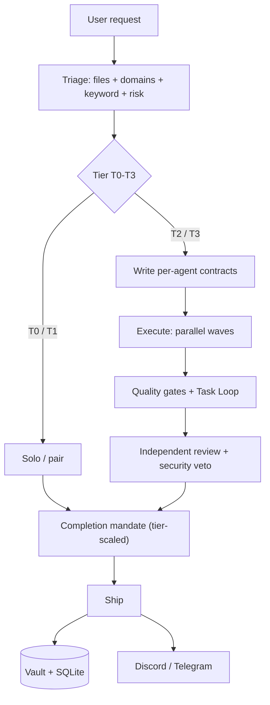
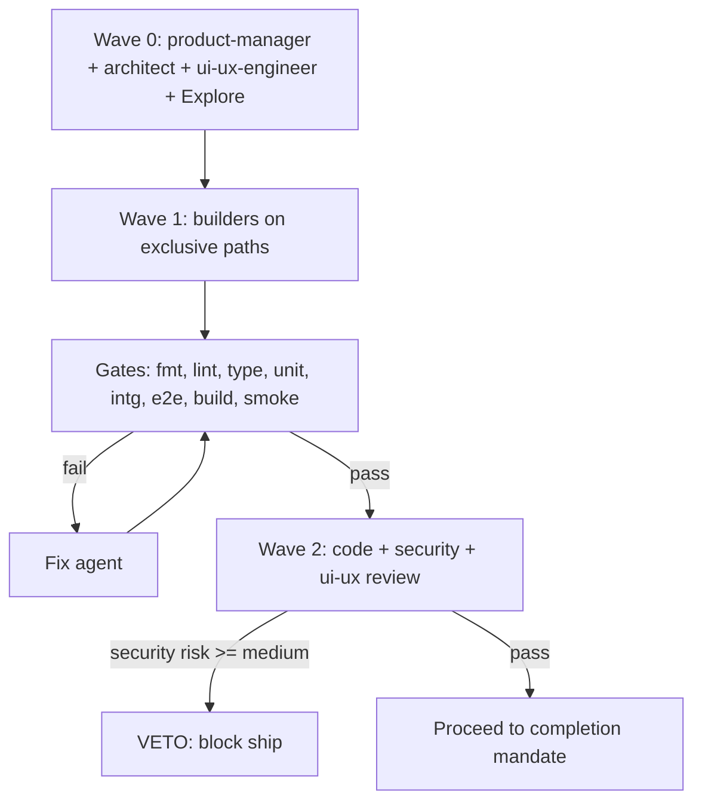
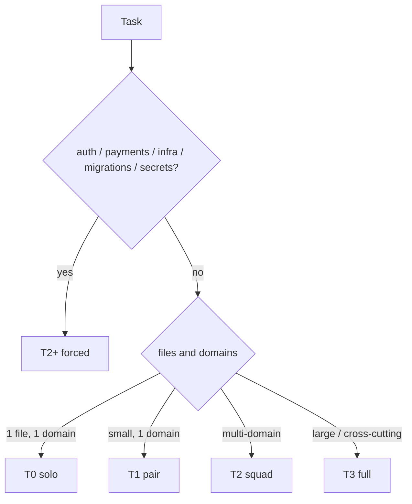
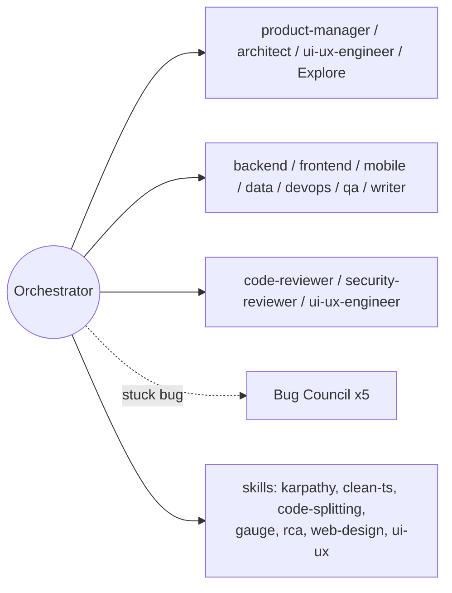
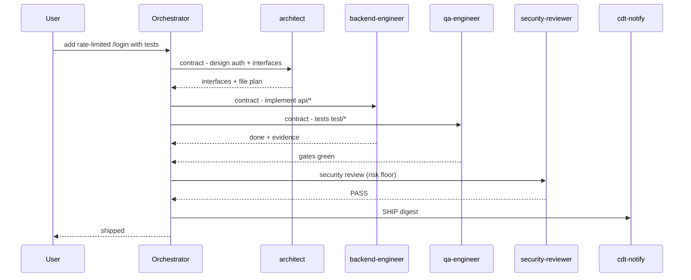
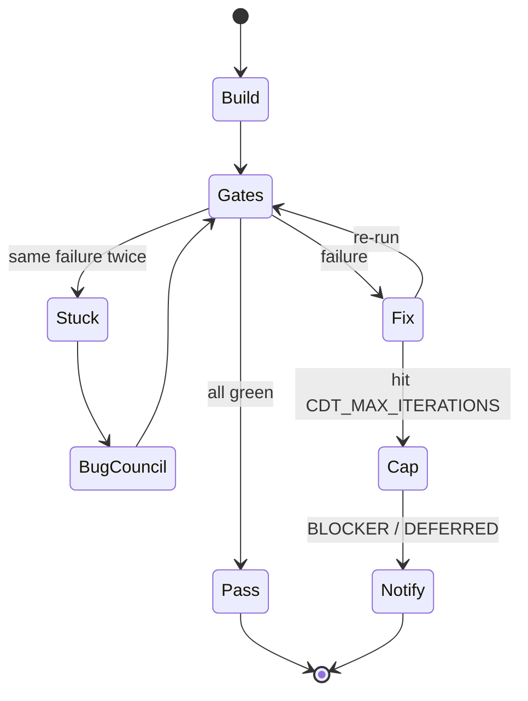
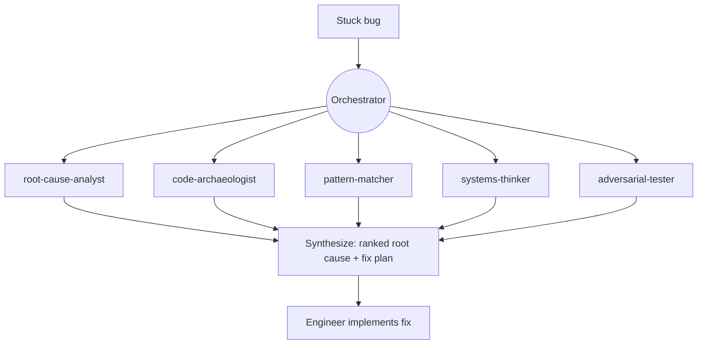

<p align="center">
  
</p>

# claude-dev-team

> An orchestrated software team for Claude Code. One **tech-lead orchestrator** triages every request,
> writes per-agent **contracts**, dispatches **specialist subagents** in parallel, runs a **quality-gate
> chain**, gets **independent review**, then **ships** — and remembers what it learned.

   [](https://github.com/jaysonventura/claude-dev-team/actions/workflows/ci.yml) [](CONTRIBUTING.md)

It is built to be **cost-effective on Claude Max while staying high quality**: cheap work stays cheap
(most tasks need no team), and the expensive machinery only engages when complexity or risk demands it.

---

## Contents

<details>
<summary>Jump to a section</summary>

- [What you get](#what-you-get) · [Why](#why)
- [Architecture](#architecture) · [Execution model](#execution-model) · [Triage & tiers](#triage--tiers)
- [The team](#the-team) · [Skills](#skills) · [Commands](#commands)
- [Installation](#installation) · [Requirements](#requirements) · [Notifications (Discord + Telegram)](#notifications-discord--telegram)
- [Usage examples](#usage-examples) · [Autonomy & debugging](#autonomy--debugging) · [State & cost analytics](#state--cost-analytics) · [Memory & recall](#memory--recall)
- [Menu bar usage monitor (macOS)](#menu-bar-usage-monitor-macos) · [Configuration](#configuration)
- [Security & privacy](#security--privacy) · [Troubleshooting](#troubleshooting) · [How to review / audit](#how-to-review--audit)
- [Uninstall](#uninstall) · [Project layout](#project-layout) · [Roadmap & contributing](#roadmap--contributing) · [License](#license)

</details>

---

## What you get

- **Tiered triage (T0–T3)** — trivial edits run solo; features escalate to a parallel team.
- **Contract-driven dispatch** — every agent gets exclusive file ownership, a read-list, a verifiable
  done-condition, guardrails, and a ≤150-word structured report. (This is the anti-hallucination engine.)
- **14 role agents** (product-manager → architect → ui-ux-engineer → builders → technical-writer →
  reviewers, incl. a Haiku `fast-ops` tier) + a gated **5-agent Bug Council** for stuck bugs.
- **10-gate quality chain** (incl. **e2e** for user-facing flows) + a bounded **Task Loop** (iterate to
  green, anti-abandonment, capped, then notify).
- **Completion mandate** (tier-scaled) — simplify, review, reuse-audit, dead-code scan, learn, ship.
- **SQLite cost analytics** (`/cdt:stats`) so you can see and tune spend on Max.
- **Discord / Telegram notifications** for every milestone — delivered, deferred, blocker, ship.
- **A markdown vault** for durable memory (learnings, ADRs, session logs).
- **8 quality skills** (karpathy guidelines, clean TS, code-splitting, gauge-improvements, RCA, web
  design, ui/ux pro-max, technical-writing) plus first-class reuse of the official `superpowers`, `code-review`,
  `frontend-design`, `figma`, and `context7` plugins.

---

## Why

LLM coding fails in predictable ways: it hallucinates APIs, claims "done" without checking, sprawls a
simple change into ten files, and forgets yesterday's lesson. `claude-dev-team` is a **discipline layer**
that fixes those structurally — contracts force grounding, gates force verification, reviewers catch
mistakes, the vault remembers, and tiering keeps it all affordable.

---

## Architecture

How a request flows (Diagram A):



## Execution model

Parallel waves and the quality-gate chain (Diagram B):



## Triage & tiers

`complexity = files + domains + keyword + risk`. Anything touching **auth, payments, infra, migrations,
or secrets** is force-escalated to **T2+** and gets the full mandate (the *risk floor*).

| Tier | Name | Agents | When |
|------|------|--------|------|
| **T0** | solo | 0 | one file, one domain, no risk |
| **T1** | pair | 0–1 | small single-domain change |
| **T2** | squad | 3–5 | multi-domain, or any risk |
| **T3** | full | 6–10 | large / cross-cutting feature |

Tier decision (Diagram C):



**Overrides you can type:** `T0:` forces solo/cheap · `FULL:` forces full-Opus + all gates for critical
work (raises model + gates only — never effort or engine).

## The team

Orchestrator, specialists, and skills (Diagram D):



| Agent | Model | Role / file scope |
|-------|-------|-------------------|
| `product-manager` | Opus | requirements + testable acceptance criteria + scope/non-goals (read-only, Wave 0) |
| `architect` | Opus | design, interfaces, contracts (read-only) |
| `backend-engineer` | inherit | APIs, server, data access, logic (`api/server/*`) |
| `frontend-engineer` | inherit | web UI/components (`ui/client/*`) |
| `mobile-engineer` | inherit | RN/Expo/Flutter/native (`mobile/app/*`) |
| `ui-ux-engineer` | Opus | UX flows, design system/tokens, accessibility + visual-polish review (`design/*`) |
| `qa-engineer` | inherit | tests + the gate chain (`test/*`) |
| `code-reviewer` | Opus | independent correctness/scope review (read-only) |
| `security-reviewer` | Opus | security review with **veto** (read-only) |
| `devops-engineer` | inherit | CI/CD, Docker, infra (`ci/* infra/*`) |
| `diagrams` | inherit | mermaid / figma visuals |
| `data-engineer` | inherit | schema, migrations, queries (`db/*`) |
| `technical-writer` | inherit | user-facing docs — README/guides/release notes/ADRs (`docs/*` prose) |
| **Bug Council** (gated ×5) | inherit | root-cause-analyst · code-archaeologist · pattern-matcher · systems-thinker · adversarial-tester |
| `fast-ops` | **Haiku** | the cheap "hands" tier — trivial mechanical ops **only** (gather, literal find/replace, rename, template fill); **never** dev/test/review/security |

**Model routing — Opus is the recommended main model.** Quality-critical work runs on a strong model;
cost-effectiveness comes from **tiering + a trivial-only low tier**, never from downgrading important
work. **Opus** reasons & reviews (product, architecture, UX, code & security) and is the right session model for
quality work; **Sonnet** (inherit) is a capable high-quality tier fine for routine throughput; **Haiku**
(`fast-ops`) is the **low tier for *trivial mechanical* ops only** — it **never** touches complicated or
quality-sensitive work (orchestration, development, testing, review, security) and escalates the instant
a task needs judgment. Run Sonnet for routine work; **Opus** (or `FULL:`) for anything that matters.

## Skills

| Skill | Use it for |
|-------|-----------|
| `orchestration` | the whole workflow (auto-triggers on dev tasks) |
| `karpathy-guidelines` | simplicity-first engineering bar |
| `clean-code-typescript` | strict, readable TS |
| `code-splitting` | file/module/bundle boundaries |
| `gauge-improvements` | prove a change is actually better |
| `root-cause-analysis` | debug to the cause, not the symptom |
| `web-design-guidelines` | UI fundamentals + a11y |
| `ui-ux-pro-max` | polish, motion, micro-interactions |
| `technical-writing` | accurate, scannable, current docs — READMEs, guides, release notes, ADRs |

Reused official plugins: `superpowers`, `code-review`, `frontend-design`, `context7` — these
**auto-install as dependencies** when you install claude-dev-team (see Installation). `figma` is optional.

## Commands

Plugin commands are **namespaced** — invoke them as `/cdt:<command>` (auto-loaded in a fresh
session; the bare `/command` form won't match).

| Command | Does |
|---------|------|
| `/cdt:triage <task>` | preview the tier + proposed dispatch **without** executing |
| `/cdt:ship` | run the completion mandate on the current work and ship |
| `/cdt:bug-council <symptom>` | convene the 5-agent diagnostic squad |
| `/cdt:autopilot <PR#> [--live]` | drive a GitHub PR toward green — CI fixes, conflicts, review (dry-run by default) |
| `/cdt:stats [today\|week\|all]` | cost & activity report from the state DB — incl. **which agents cost the most tokens** |
| `/cdt:recall <task>` | recall the most relevant past lessons from the vault for a task |
| `/cdt:advise <task>` | advisory tier/effort prior learned from how similar past tasks went |
| `/cdt:config [...]` | enable/disable CDT + set defaults (effort, model, eco, statusline); defaults xhigh + Opus 4.8 |
| `/cdt:doctor` | health-check the install (hooks, CLIs, DB, gh, notifier, menu bar, deps) |
| `/cdt:deps [--install]` | check / install system prerequisites (python3, git, curl, sqlite3, gh) |
| `/cdt:worktree [new\|list\|rm\|...]` | git-worktree isolation for parallel work (interops with `claude --worktree`) |
| `/cdt:budget` | show usage % + the Eco (conserve-when-low) recommendation |
| `/cdt:learn <lesson>` | teach the vault a durable lesson (surfaced later by recall) |
| `/cdt:notify-setup [...]` | configure Discord/Telegram (no manual `.env`) |
| `/cdt:menubar [install\|status\|...]` | macOS menu bar usage monitor (subscription % + local tokens) |

---

## Installation

### Requirements

**Claude Code ≥ 2.1.143** (so dependencies auto-*enable*, not just install; on 2.1.110–2.1.142 the
companions install but you may need to enable them once). The official marketplace must be registered (it
ships by default — else `claude plugin marketplace add anthropics/claude-plugins-official`).

**System tools** — run **`~/.claude/bin/cdt-deps`** to check what's present, **`cdt-deps --install`** to
install the missing ones via your package manager:

| Tool | Required? | Used for | macOS | Debian/Ubuntu | Windows |
|------|-----------|----------|-------|---------------|---------|
| **python3** | **required** | recall, advise, config, status line, analytics | `brew install python3` | `apt install python3` | python.org · `winget install Python.Python.3.12` |
| **git** | **required** | install, autopilot, version ops | `brew install git` | `apt install git` | gitforwindows.org · `winget install Git.Git` |
| **bash** | **required** | runs the hooks & `cdt-*` CLIs | preinstalled | preinstalled | **Git for Windows** (Git Bash) |
| **curl** | recommended | Discord / Telegram notifications | preinstalled | `apt install curl` | Git Bash |
| **sqlite3** (CLI) | optional | analytics CLI — *python3 fallback exists* | `brew install sqlite` | `apt install sqlite3` | `winget install SQLite.SQLite` |
| **gh** | optional | PR autopilot | `brew install gh` | `apt install gh` | `winget install GitHub.cli` |
| **swift** (Xcode) | optional | the macOS menu bar app only | `xcode-select --install` | — | — |

**No Python packages to install** — every script uses the **python3 standard library only** (`json`,
`sqlite3`, `re`, …). There is no `pip install` step.

**Companion plugins auto-install** with claude-dev-team (declared as manifest `dependencies`):
`superpowers`, `code-review`, `frontend-design`, `context7` (`figma` is optional).

**Platforms:** macOS · Linux · **Windows** — each has a step-by-step guide in
[Step 2 — Set up your platform](#step-2--set-up-your-platform) below. The **menu bar is macOS-only**;
elsewhere use the cross-platform status line.

### Step 1 — Install the plugin (all platforms)

```
claude plugin marketplace add jaysonventura/claude-dev-team
claude plugin install cdt@claude-dev-team
```

> The repo / marketplace is **`claude-dev-team`** (the project); the plugin installs as **`cdt`**, so its
> commands are short — **`/cdt:ship`**, **`/cdt:doctor`**, … (matching the `cdt-*` CLIs).

Install **auto-enables** the plugin and its companions (`superpowers`, `code-review`, `frontend-design`,
`context7`) — no manual enable step. It's a **user-scope** install in `~/.claude/`, shared across every
Claude Code surface on this machine (the CLI, the VS Code & JetBrains extensions, and the desktop app).
*(Non–Claude-Code tools like Google Antigravity run a different engine and won't load it.)*

### Step 2 — Set up your platform

Follow the guide for your OS, then run **`/cdt:doctor`** — it verifies hooks, CLIs, the DB, `gh`, the
notifier, the menu bar, and companion plugins, and prints a fix for anything not green.

<details open>
<summary><b>🍎 macOS</b></summary>

1. **Install the system tools** (or run `~/.claude/bin/cdt-deps --install` to do it for you):
   ```
   brew install python3 git          # required · gh + sqlite are optional
   ```
2. **Restart your Claude Code session** (or run `/reload-plugins`) so the plugin loads.
3. **Menu bar app** — it builds + installs automatically on your first session (look for the **CDT** item
   showing your session/weekly %). It needs the Swift toolchain — if it doesn't appear, run
   `xcode-select --install`, or grab the **notarized DMG** from the [Releases](https://github.com/jaysonventura/claude-dev-team/releases) page. Manage it with `/cdt:menubar`.
4. **Verify:** `/cdt:doctor` → all green. Done — just describe a task.

</details>

<details>
<summary><b>🪟 Windows</b></summary>

Claude Code runs the plugin's `.sh` hooks through **Git Bash**, so:

1. **Install [Git for Windows](https://gitforwindows.org/)** (provides Bash) and
   **[Python 3](https://www.python.org/downloads/)** — tick *"Add Python to PATH"* during setup.
2. **If you also have WSL,** pin Git Bash so hooks don't resolve to WSL's `bash.exe`. Add to
   `%USERPROFILE%\.claude\settings.json`:
   ```json
   { "env": { "CLAUDE_CODE_GIT_BASH_PATH": "C:\\Program Files\\Git\\bin\\bash.exe" } }
   ```
3. **Restart your Claude Code session** (or `/reload-plugins`).
4. **Usage display** — the menu bar is macOS-only; turn on the cross-platform **status line** instead:
   ```
   ~/.claude/bin/cdt-config statusline on
   ```
5. **Verify:** `/cdt:doctor` → all green. *(Shell scripts ship with LF line endings via `.gitattributes`,
   so Git's autocrlf can't break them.)*

</details>

<details>
<summary><b>🐧 Linux</b></summary>

Bash + Python 3 are standard, so it works out of the box:

1. Make sure `python3` and `git` are installed (`~/.claude/bin/cdt-deps --install` adds any missing via
   apt / dnf / pacman / zypper).
2. **Restart your Claude Code session.**
3. **Usage display** — the menu bar is macOS-only; use the status line: `cdt-config statusline on`.
4. **Verify:** `/cdt:doctor` → all green.

</details>

### After install → just prompt (zero config)

Describe any task normally. The `orchestration` skill auto-triggers, the SessionStart hook bootstraps the
vault + SQLite DB + `cdt-*` CLIs, skills auto-apply, and the `/cdt:*` commands are available.

- **Notifications are optional** — run `/cdt:notify-setup` only if you want Discord/Telegram pushes.
- **Always-on (power users):** for a hard guarantee every session, drop the `orchestration` summary into
  your global `~/.claude/CLAUDE.md` (see [`docs/architecture.md`](docs/architecture.md)). Most users don't need this.

---

## Notifications (Discord + Telegram)

Milestones (`DELIVERED` / `DEFERRED` / `BLOCKER` / `SHIP`) are logged to the vault and pushed to your
channel(s). Secrets live in `~/.claude/claude-dev-team.env` (`chmod 600`, **never committed**) — you
never hand-edit them.

**⚡ Fastest path — the wizard** (hidden input for tokens):
```
!~/.claude/bin/cdt-setup
```
Pick Discord / Telegram / Both, paste the secret; it auto-detects the chat id and auto-tests. Done.

> 💡 The `!` prefix runs a command from **inside Claude Code's input box**. In a **plain terminal**,
> drop the `!` (zsh reads a leading `!` as history expansion → `event not found`). Use the full path
> either way: `~/.claude/bin/cdt-setup …`

Prefer a single command? Use the slash command **`/cdt:notify-setup`** (all plugin commands
use the `/cdt:` prefix), or the `cdt-setup` CLI directly.

### Discord — step by step
1. In Discord: **Server Settings → Integrations → Webhooks → New Webhook**.
2. Pick a channel, click **Copy Webhook URL**.
3. Configure it (one line):
   ```
   /cdt:notify-setup discord https://discord.com/api/webhooks/XXXXXX/YYYYYY
   ```
   …or via CLI: `!~/.claude/bin/cdt-setup --discord "<url>"`
4. A test message lands in that channel. Done.

### Telegram — step by step
1. In Telegram, open **@BotFather** → send `/newbot` → follow prompts → **copy the bot token**
   (looks like `123456789:AA...`).
2. **Open your new bot and send it any message** (e.g. `hi`). *(Required — the bot can only find your
   chat id after you message it first.)*
3. Configure it — the chat id is **auto-detected** from the token, so you don't need to find it:
   ```
   /cdt:notify-setup telegram <your-bot-token>
   ```
   …or via CLI: `!~/.claude/bin/cdt-setup --telegram <your-bot-token>` → `Telegram saved (chat id: …)`
4. Send a test: `!~/.claude/bin/cdt-setup --test` → you should get a Telegram message.

### Message format
Notifications are **rich and detailed**, not one-liners — a colored **Discord embed** (green delivered,
red blocker, …) and a **formatted Telegram** message, each with the **task**, **tier**, **how long it
took**, **Task-Loop iterations**, and the **tokens *this task* used** (an input+output delta — not a
cumulative/remaining figure), plus a timestamp:

```
✅ DELIVERED
/login endpoint shipped: rate-limited, 12 tests green
  Task: add /login endpoint   ·   Tier: T2   ·   Duration: 2m 5s   ·   Iterations: 1
  Tokens (this task): 48.3k tokens
```

The orchestrator fills these in automatically — it captures a `cdt-tokens` baseline at the start and
passes the delta + duration at delivery (`--task … --tier … --duration … --tokens …`).

### Settings
`CDT_NOTIFY_PROVIDER` = `discord` | `telegram` | `both` | `off` · `CDT_NOTIFY_LEVEL` = `all` |
`milestones` | `off`. Credentials live in `~/.claude/claude-dev-team.env` (`chmod 600`, **never
committed**).

---

## Usage examples

Just describe the task — the orchestrator triages and runs the right amount of process.

- **T0 — "fix this typo in the README"** → stays solo, edits, verifies, ships. One model call.
- **T2 — "add a rate-limited `/login` endpoint with tests"** → risk floor forces T2+: `architect`
  designs the interface, `backend-engineer` implements (`api/*`), `qa-engineer` writes tests (`test/*`),
  gates run, `security-reviewer` checks the auth path, then ship + a Discord post.
- **T3 — "build a settings page (web + mobile) with API + a migration"** → full team in parallel waves:
  architect → backend + frontend + mobile + data (exclusive paths) → gates + Task Loop → code + security
  review → ship + vault learning.

T2 example as a sequence (Diagram E):



---

## Autonomy & debugging

**Task Loop** — bounded autonomous quality enforcement (Diagram F):



**Bug Council** — convened only when stuck (Diagram G):



Anti-abandonment: agents must emit a structured `BLOCKER` rather than quit or fake success. The loop
stops after `CDT_MAX_ITERATIONS` (default 5) and notifies you — protecting your Max rate limits.

**PR autopilot (opt-in).** `/cdt:autopilot <PR#>` drives a real GitHub PR toward green: read
CI status → diagnose + dispatch a focused fix → push to the branch → re-check → and, once green, post a
`code-reviewer` + `security-reviewer` synthesis as a PR comment. It's deliberately **safe**: **dry-run by
default** (add `--live` to act), **never force-pushes, never auto-merges, never closes** — merging stays
your explicit call. Bounded by `CDT_MAX_ITERATIONS`, reports each step via the notifier. Needs `gh`
authenticated. Uses a read-mostly wrapper (`cdt-pr`) whose only write is posting a comment.

---

## Parallel isolation (git worktrees)

For **large parallel work** — several features at once, or isolating each builder in a big T3 wave —
CDT turns its *disjoint-paths* convention into a **hard filesystem guarantee** with git worktrees: each
strand gets its own checkout + branch, so even shared-file edits can't collide.

```
~/.claude/bin/cdt-worktree new <name>     # isolated checkout at .claude/worktrees/<name> (branch worktree-<name>)
~/.claude/bin/cdt-worktree list           # see all worktrees
~/.claude/bin/cdt-worktree rm <name>      # remove after committing + merging back (refuses dirty without --force)
```

It **interoperates with Claude Code's native flag** — `cdt-worktree new feat` and `claude --worktree feat`
open the *same* checkout — so you can spin up a worktree and drop a parallel session into it. CDT's state
(DB, vault, `cdt-*` CLIs) lives in `~/.claude/`, so **every worktree inherits the full toolchain for
free**. Safe by design: names are validated (no path traversal), removal refuses a dirty/locked worktree
unless you pass `--force`, and `.claude/worktrees/` is auto-added to `.gitignore`.

> **Opt-in, on purpose.** Worktree setup has real cost — it's for *genuinely large, parallelizable*
> work. Small tasks (T0–T2) stay bounded and in-place. This is **Phase 1 of the scaling track**
> ([`docs/roadmap.md`](docs/roadmap.md)); agent-team councils and dynamic-workflow Scale mode follow.

---

## State & cost analytics

A local SQLite DB (`~/.claude/claude-dev-team.db`) records `sessions`, `tasks`, `agent_runs`, `events`,
and `usage`. Run `/cdt:stats` (or `cdt-stats today|week|all`) for activity by tier/agent, iteration
counts, and blocker rate. Activity/timing is precise. "Cost" here means **token / rate-limit budget**
(Claude subscription session + weekly limits, not money); for exact tokens used, see Claude Code's `/cost`.

**Per-agent token telemetry (real, not estimated).** A `SubagentStop` hook sums each dispatched
subagent's **actual** token usage straight from its transcript (input + output + cache) and stores it on
the `agent_runs` row — so `/cdt:stats` ranks **which roles cost the most**, and tasks carry a per-tier
token total. This is grounded in real usage rows, never a guess. Example:

```
Agent runs — which roles cost the most (role · runs · tokens):
  security-reviewer  ×6  4.1M
  backend-engineer   ×3  2.3M
  qa-engineer        ×2  610.0k
Total agent tokens: 7.0M
```

Use it to tune routing — e.g. if a role dominates spend, reserve `FULL:` / Opus builders for the work
that truly needs them.

**Adaptive routing (learns from history):** on T2+, the orchestrator also runs
`cdt-advise "<task>"` — an *advisory* prior derived from how **similar past tasks** went (typical tier,
iteration budget, blocker rate). It's a hint that sharpens triage over time, never a hard rule — the
orchestrator still decides. Pure local DB read, no new dependencies.

## Memory & recall

The orchestrator keeps **durable memory** in a markdown vault (`~/.claude/vault/`): `learnings.md`
(lessons), `sessions/` (per-task notes), `adrs/`, and `log.md` / `status-log.md`. The completion mandate
appends a lesson after meaningful work, so it gets smarter over time.

To stay **cost-effective as the vault grows**, memory is *retrieved, not dumped*: each session injects
only the few most recent lessons, and for a specific task the orchestrator runs **targeted recall** —

```
~/.claude/bin/cdt-recall "<task or topic>"        # or: /cdt:recall <task>
```

— which lexically ranks the lessons and returns just the top matches (pure stdlib — **no embedding model
or network**). Context stays lean and sharp no matter how large the vault grows.

## Menu bar usage monitor (macOS)

A native Swift app (`menubar/`) puts your usage in the menu bar as a compact **`CDT`** badge with the
**current-session %** stacked over the **weekly %** (each color-coded 80/90) — a deliberately narrow,
two-line shape that survives a crowded or notched menu bar. Click it for the full dropdown:

- **Subscription %** — current session, weekly (all-models), and weekly Sonnet, each with a reset
  countdown, from Anthropic's `oauth/usage` endpoint.
- **Tokens today (local)** — your real token usage by model (with cache) and the 7-day total, summed
  from your own `~/.claude/projects` transcripts.
- **`claude-dev-team` activity panel** — an **Enabled** toggle plus **Eco mode / Effort / Model**
  submenus to change CDT's defaults right from the bar (they call `cdt-config`; effort/model apply next
  session), then the **7-day activity**: sessions logged, **tasks by tier** (e.g. `T2×4 T3×2`), and the
  **specialist subagents dispatched by role** (e.g. `security-reviewer ×6`). For each role's **token
  cost**, run `/cdt:stats`.

<p align="center">
  
</p>

> **macOS only.** On **Windows/Linux** there's no menu bar — use the cross-platform **status line** for
> the same usage display: `~/.claude/bin/cdt-config statusline on` (shows `CDT on · Opus · xhigh · 41% wk`).

**On macOS it auto-installs** on your first session after the plugin is installed — it builds, launches,
and enables login auto-start automatically (set `CDT_MENUBAR_AUTO=0` in `~/.claude/claude-dev-team.env`
to opt out). Manage it any time:

```
!~/.claude/bin/cdt-menubar status      # one-shot terminal readout, no GUI
/cdt:menubar restart       # or: install | start | stop | uninstall
```

Requires macOS + the Swift toolchain (`xcode-select --install`); first launch shows a one-time Keychain
approval (**Always Allow**). The subscription %s use an **undocumented** endpoint (the same one Claude
Code calls) and may change — it **fails soft**, and your local token data always works. `cdt-menubar
uninstall` removes the login item + binary (and stops auto-reinstall).

**Distributing a prebuilt app:** the build auto-signs with any available code-signing identity. To ship a
**notarized DMG** that opens on any Mac with no Gatekeeper warnings (drag to Applications, like an App
Store app), see [`menubar/RELEASING.md`](menubar/RELEASING.md) — it needs a Developer ID Application
certificate + `notarytool` credentials, then `cd menubar && ./release.sh`.

## Configuration

| Setting | Default | Meaning |
|---------|---------|---------|
| session model | your choice | Sonnet = cheap throughput; Opus = max power |
| `FULL:` / `T0:` prefixes | — | up/down-throttle a single request |
| `CDT_MAX_ITERATIONS` | 5 | Task Loop hard cap |
| `CDT_NOTIFY_PROVIDER` | off | `discord` / `telegram` / `both` / `off` |
| `CDT_NOTIFY_LEVEL` | milestones | `all` / `milestones` / `off` |
| `CDT_STOP_REMINDER` | 0 | `1` = remind once to run the mandate at session end |

Effort runs at your session level and the orchestration never uses heavy multi-agent fan-out engines —
it dispatches a bounded set of subagents per tier. Pin any agent's `model:` in `agents/*.md` to taste.

**Enable/disable + defaults — `cdt-config` (or `/cdt:config`):**

```
~/.claude/bin/cdt-config                 # show current config
~/.claude/bin/cdt-config off | on        # disable / enable the whole orchestration layer
~/.claude/bin/cdt-config effort xhigh    # default effort: low | medium | high | xhigh
~/.claude/bin/cdt-config model  opus     # default model (e.g. claude-opus-4-8 / opus / sonnet)
~/.claude/bin/cdt-config reset           # restore defaults: enabled, xhigh, Opus 4.8
```

Defaults are **xhigh effort + Opus 4.8** (`claude-opus-4-8`). `off` makes the next session behave as
stock Claude Code (the SessionStart hook stops injecting the orchestration protocol). `effort`/`model`
are written to `~/.claude/settings.json` as a **safe merge** (your other settings are preserved) and
apply next session. The **macOS menu bar dropdown** also lets you change all of this with a click — an
**Enabled** toggle plus **Eco mode**, **Effort**, and **Model** submenus (each runs `cdt-config` for you).
(`max` effort is session-only — `/effort max` — and intentionally can't be persisted; xhigh is the cap.)

**Budget-aware Eco mode + status line** (also via `cdt-config`):

```
~/.claude/bin/cdt-config eco auto         # opt in to conserve when weekly usage is high (default: off)
~/.claude/bin/cdt-config statusline on    # terminal status line: CDT on · Opus · xhigh · 41% wk
~/.claude/bin/cdt-doctor                  # health-check the whole install
~/.claude/bin/cdt-budget                  # current usage % + Eco recommendation
~/.claude/bin/cdt-learn "<lesson>"        # teach the vault a durable lesson
```

Eco is **off by default** (full quality). Opt in with `cdt-config eco on` (always conserve) or
`eco auto` (conserve only when your weekly usage is high). When conserving, the orchestrator prefers
Sonnet, the smallest safe tier, and skips optional agents — and tells you why. **Eco never weakens the
risk floor or skips the security review**, and never uses Haiku for real work. Usage data is supplied
automatically by the **macOS menu bar** (it caches each fetch); on **Linux/Windows**, enable the
cross-platform **status line** (`cdt-config statusline on`) to feed it.

## Security & privacy

`claude-dev-team` runs **entirely on your machine** and phones home to nothing.

- **No telemetry.** The plugin sends no analytics anywhere. The only outbound traffic is what *you*
  configure: milestone messages to *your own* Discord/Telegram channel.
- **Secrets** (notifier webhook/token) live in `~/.claude/claude-dev-team.env` (`chmod 600`, gitignored,
  never committed). Input is strictly validated and handed to `curl` via a stdin config, so secrets never
  appear in the process list (`ps`).
- **The menu bar app** (macOS, optional) reads Claude Code's existing OAuth token from your **Keychain**
  (never logged) and calls Anthropic's `oauth/usage` endpoint over TLS — the token is only ever sent to
  `api.anthropic.com`. That endpoint is **undocumented** (the same one Claude Code uses) and may change;
  the app **fails soft** if it does. Token *counts* are summed from your own local `~/.claude/projects`
  transcripts and are never transmitted.
- **Hooks are fail-open and local** — they read/write only under `~/.claude/` and exit 0 on any error, so
  they can't break or leak your session.

## Troubleshooting

| Symptom | Fix |
|---------|-----|
| Commands/agents don't show up | Restart the session or run `/reload-plugins`; confirm `claude plugin list` shows `claude-dev-team` enabled. Commands are **namespaced**: `/cdt:<cmd>`. |
| Companion plugins didn't enable | You're on Claude Code &lt; 2.1.143 — update, or enable `superpowers` / `code-review` / `frontend-design` / `context7` once manually. |
| Notifications never arrive | `~/.claude/bin/cdt-setup --show` — provider must not be `off`, level not `off`. Re-run `--test`. Discord: webhook still valid? Telegram: did you message the bot **first**? Is `curl` installed? |
| `cdt-*: command not found` | In a **plain terminal** use the full path `~/.claude/bin/cdt-…` (the `!cdt-…` shorthand only works **inside** Claude Code's input box). |
| Menu bar item missing (macOS) | Needs the Swift toolchain (`xcode-select --install`). Check `~/.claude/bin/cdt-menubar status`; approve the one-time Keychain prompt (**Always Allow**); `cdt-menubar restart`. It installs to **/Applications → "CDT Usage"**. |
| Subscription shows "unavailable" | The undocumented usage endpoint or your login is unavailable — it **fails soft**; local token counts still work. Try **Refresh now** (⌘R). |
| "Orchestration isn't dispatching agents" | By design — only **T2+** (multi-domain or risk) fans out; small tasks stay solo. See [Triage & tiers](#triage--tiers). Force it with a multi-domain/risk task or the `FULL:` prefix. |
| No vault / DB / CLIs after install | The SessionStart hook bootstraps them — **restart your session once** after installing. |
| Hooks/CLIs not running on **Windows** | Install **Git for Windows** + **Python 3**; if WSL is also present, pin `CLAUDE_CODE_GIT_BASH_PATH` (see the [Windows setup](#step-2--set-up-your-platform)). Then run `/cdt:doctor`. The menu bar is macOS-only — use `cdt-config statusline on`. |

## How to review / audit

Everything is plain files. Check: agents honoring exclusive scope (the diffs), gates actually run
(pasted output in reports), `~/.claude/vault/` session notes + learnings, `status-log.md`, and the DB
(`/cdt:stats`).

**Run the test flow yourself** (all four run in CI on every push/PR):

```
bash scripts/validate.sh        # manifests + frontmatter + shellcheck
bash scripts/lint-agents.sh     # agent least-privilege lint (no fan-out, read-only stays read-only, model pins)
python3 -m unittest discover -s demo/login-rate-limit/tests -t demo/login-rate-limit   # unit tests
bash scripts/e2e.sh             # sandboxed end-to-end (temp HOME — never touches your ~/.claude)
```

The **e2e** boots the SessionStart hook in a throwaway sandbox and asserts the whole chain works
(CLIs installed → doctor → learn→recall → task→stats → statusline→budget → config on/off → notify→log).
To remove the plugin entirely, see [Uninstall](#uninstall).

## Uninstall

```bash
# 1) remove the plugin (stops the hooks / agents / skills / commands)
claude plugin uninstall cdt

# 2) remove the macOS menu bar app + its login item (macOS only)
~/.claude/bin/cdt-menubar uninstall

# 3) (optional) wipe local state — vault, SQLite DB, CLIs, notifier creds, staged app source
rm -rf ~/.claude/vault ~/.claude/claude-dev-team.db ~/.claude/claude-dev-team.env \
       ~/.claude/bin/cdt-* ~/.claude/claude-dev-team-menubar \
       ~/.claude/.cdt-menubar-installed ~/.claude/.cdt-menubar-disabled
```

If you added the always-on activator, delete the orchestration block from `~/.claude/CLAUDE.md`. The
companion plugins (`superpowers`, etc.) are independent — uninstall them separately if you wish. After
step 1 you're back to stock Claude Code.

## Project layout

```
.claude-plugin/   plugin.json, marketplace.json
agents/           14 core role agents (incl. product-manager, ui-ux-engineer, technical-writer, Haiku fast-ops) + 5 Bug Council agents (flat)
skills/           orchestration (brain) + 8 skills (quality, design, debug, technical-writing)
commands/         ship, triage, bug-council, autopilot, stats, notify-setup, menubar, recall, advise, config, doctor, budget, learn, deps, worktree
hooks/            hooks.json + scripts (vault/db/recall/advise/pr/config/doctor/learn/budget/statusline/deps/worktree/format/notify/setup/stats/guard) + vault-template
docs/             architecture.md, examples.md, roadmap.md
```

## Roadmap & contributing

**Near-term:** more agents (`pm`, `technical-writer`, `ml-engineer`); a measured roster expansion (SRE,
accessibility, performance auditor); media/writing skills; an opt-in Eco mode; richer cost attribution.

**The bigger arc** — two layered tracks. A *learning* track (autonomous Git/CI/PR loop, semantic RAG
memory, history-driven adaptive routing) and a *scaling* track that adds **opt-in, gated** parallelism on
Claude Code's official primitives: **worktree-isolated parallel builders**, **agent-team Bug Council**
(a debating council, not parallel monologues), and a **dynamic-workflow "Scale mode"** for repo-wide
audits/migrations — each summoned, capped, and measured by the per-agent token telemetry, never the
default. The full phased plan, with fit/risk/cost per phase, lives in **[`docs/roadmap.md`](docs/roadmap.md)**.

**Contributing:** see **[`CONTRIBUTING.md`](CONTRIBUTING.md)**. To add an agent, drop a markdown file in
`agents/`; to add a skill, a folder + `SKILL.md` in `skills/`. Run `bash scripts/validate.sh` before a
PR. PRs welcome.

## License

MIT © 2026 Jayson Ventura.
