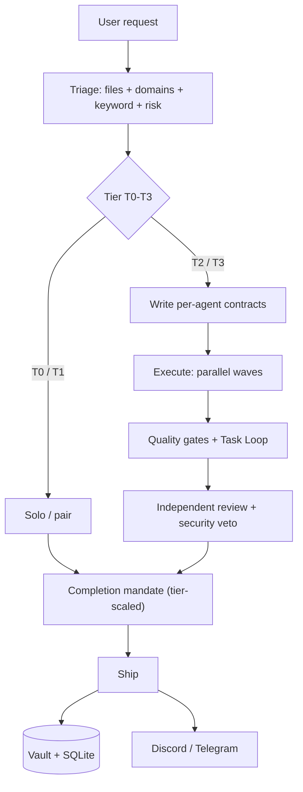
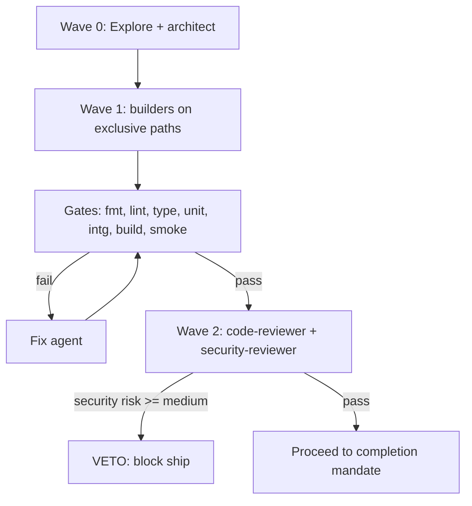
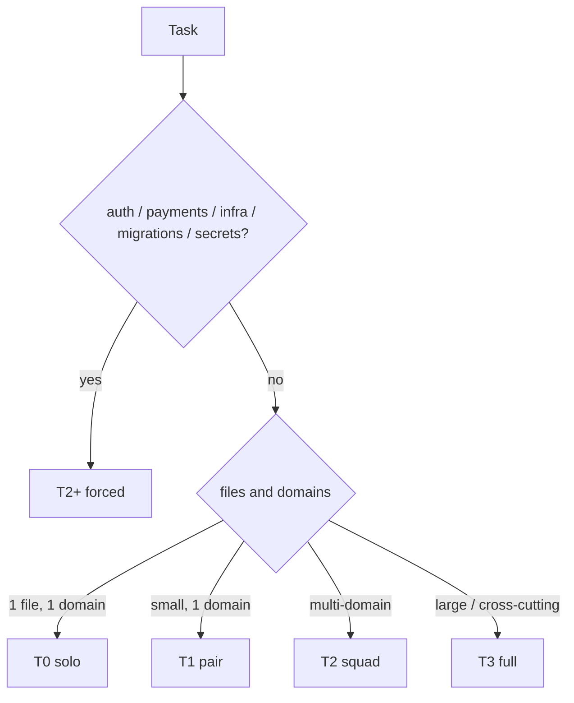
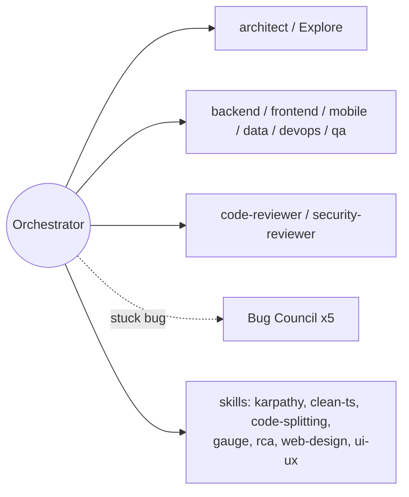
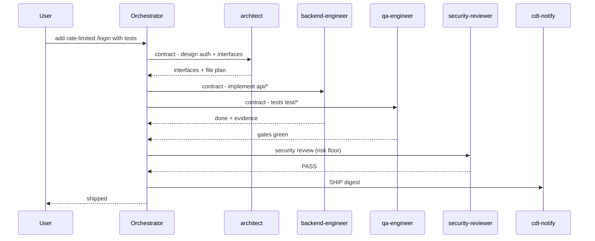
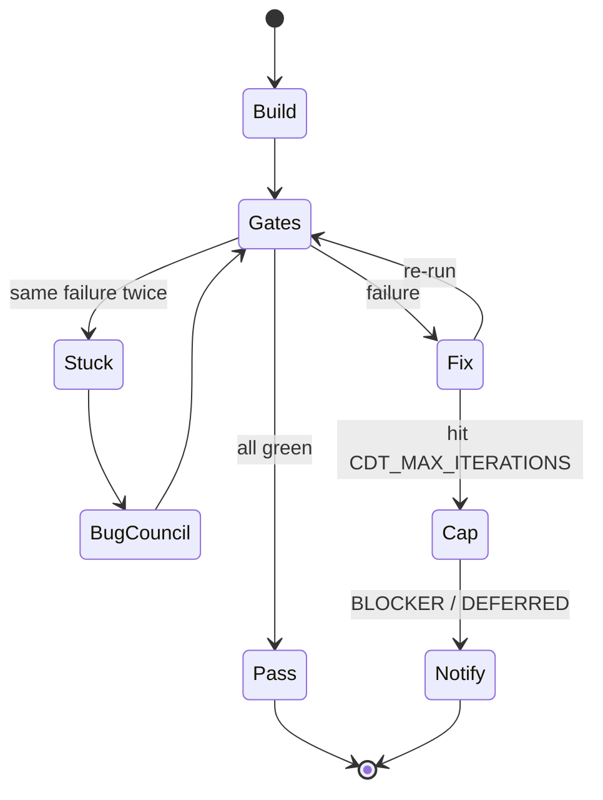
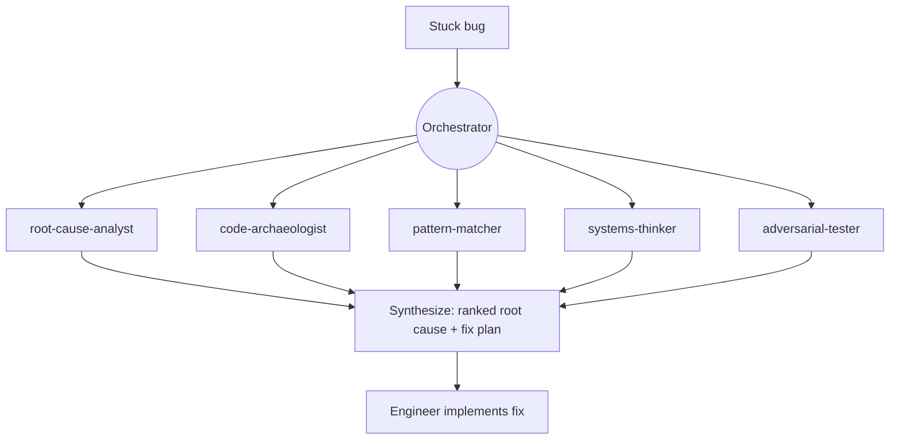

<p align="center">
  
</p>

# claude-dev-team

> An orchestrated software team for Claude Code. One **tech-lead orchestrator** triages every request,
> writes per-agent **contracts**, dispatches **specialist subagents** in parallel, runs a **quality-gate
> chain**, gets **independent review**, then **ships** — and remembers what it learned.

   [](https://github.com/jaysonventura/claude-dev-team/actions/workflows/ci.yml) [](CONTRIBUTING.md)

It is built to be **cost-effective on Claude Max while staying high quality**: cheap work stays cheap
(most tasks need no team), and the expensive machinery only engages when complexity or risk demands it.

---

## Contents

<details>
<summary>Jump to a section</summary>

- [What you get](#what-you-get) · [Why](#why)
- [Architecture](#architecture) · [Execution model](#execution-model) · [Triage & tiers](#triage--tiers)
- [The team](#the-team) · [Skills](#skills) · [Commands](#commands)
- [Installation](#installation) · [Notifications (Discord + Telegram)](#notifications-discord--telegram)
- [Usage examples](#usage-examples) · [Autonomy & debugging](#autonomy--debugging) · [State & cost analytics](#state--cost-analytics) · [Memory & recall](#memory--recall)
- [Menu bar usage monitor (macOS)](#menu-bar-usage-monitor-macos) · [Configuration](#configuration)
- [Security & privacy](#security--privacy) · [Troubleshooting](#troubleshooting) · [How to review / audit](#how-to-review--audit)
- [Uninstall](#uninstall) · [Project layout](#project-layout) · [Roadmap & contributing](#roadmap--contributing) · [License](#license)

</details>

---

## What you get

- **Tiered triage (T0–T3)** — trivial edits run solo; features escalate to a parallel team.
- **Contract-driven dispatch** — every agent gets exclusive file ownership, a read-list, a verifiable
  done-condition, guardrails, and a ≤150-word structured report. (This is the anti-hallucination engine.)
- **11 role agents** (incl. a Haiku `fast-ops` tier) + a gated **5-agent Bug Council** for stuck bugs.
- **9-gate quality chain** + a bounded **Task Loop** (iterate to green, anti-abandonment, capped, then
  notify).
- **Completion mandate** (tier-scaled) — simplify, review, reuse-audit, dead-code scan, learn, ship.
- **SQLite cost analytics** (`/claude-dev-team:stats`) so you can see and tune spend on Max.
- **Discord / Telegram notifications** for every milestone — delivered, deferred, blocker, ship.
- **A markdown vault** for durable memory (learnings, ADRs, session logs).
- **7 quality skills** (karpathy guidelines, clean TS, code-splitting, gauge-improvements, RCA, web
  design, ui/ux pro-max) plus first-class reuse of the official `superpowers`, `code-review`,
  `frontend-design`, `figma`, and `context7` plugins.

---

## Why

LLM coding fails in predictable ways: it hallucinates APIs, claims "done" without checking, sprawls a
simple change into ten files, and forgets yesterday's lesson. `claude-dev-team` is a **discipline layer**
that fixes those structurally — contracts force grounding, gates force verification, reviewers catch
mistakes, the vault remembers, and tiering keeps it all affordable.

---

## Architecture

How a request flows (Diagram A):



## Execution model

Parallel waves and the quality-gate chain (Diagram B):



## Triage & tiers

`complexity = files + domains + keyword + risk`. Anything touching **auth, payments, infra, migrations,
or secrets** is force-escalated to **T2+** and gets the full mandate (the *risk floor*).

| Tier | Name | Agents | When |
|------|------|--------|------|
| **T0** | solo | 0 | one file, one domain, no risk |
| **T1** | pair | 0–1 | small single-domain change |
| **T2** | squad | 3–5 | multi-domain, or any risk |
| **T3** | full | 6–10 | large / cross-cutting feature |

Tier decision (Diagram C):



**Overrides you can type:** `T0:` forces solo/cheap · `FULL:` forces full-Opus + all gates for critical
work (raises model + gates only — never effort or engine).

## The team

Orchestrator, specialists, and skills (Diagram D):



| Agent | Model | Role / file scope |
|-------|-------|-------------------|
| `architect` | Opus | design, interfaces, contracts (read-only) |
| `backend-engineer` | inherit | APIs, server, data access, logic (`api/server/*`) |
| `frontend-engineer` | inherit | web UI/components (`ui/client/*`) |
| `mobile-engineer` | inherit | RN/Expo/Flutter/native (`mobile/app/*`) |
| `qa-engineer` | inherit | tests + the gate chain (`test/*`) |
| `code-reviewer` | Opus | independent correctness/scope review (read-only) |
| `security-reviewer` | Opus | security review with **veto** (read-only) |
| `devops-engineer` | inherit | CI/CD, Docker, infra (`ci/* infra/*`) |
| `diagrams` | inherit | mermaid / figma visuals |
| `data-engineer` | inherit | schema, migrations, queries (`db/*`) |
| **Bug Council** (gated ×5) | inherit | root-cause-analyst · code-archaeologist · pattern-matcher · systems-thinker · adversarial-tester |
| `fast-ops` | **Haiku** | the cheap "hands" tier — trivial mechanical ops **only** (gather, literal find/replace, rename, template fill); **never** dev/test/review/security |

**Model routing — Opus is the recommended main model.** Quality-critical work runs on a strong model;
cost-effectiveness comes from **tiering + a trivial-only low tier**, never from downgrading important
work. **Opus** reasons & reviews (architect, code & security review) and is the right session model for
quality work; **Sonnet** (inherit) is a capable high-quality tier fine for routine throughput; **Haiku**
(`fast-ops`) is the **low tier for *trivial mechanical* ops only** — it **never** touches complicated or
quality-sensitive work (orchestration, development, testing, review, security) and escalates the instant
a task needs judgment. Run Sonnet for routine work; **Opus** (or `FULL:`) for anything that matters.

## Skills

| Skill | Use it for |
|-------|-----------|
| `orchestration` | the whole workflow (auto-triggers on dev tasks) |
| `karpathy-guidelines` | simplicity-first engineering bar |
| `clean-code-typescript` | strict, readable TS |
| `code-splitting` | file/module/bundle boundaries |
| `gauge-improvements` | prove a change is actually better |
| `root-cause-analysis` | debug to the cause, not the symptom |
| `web-design-guidelines` | UI fundamentals + a11y |
| `ui-ux-pro-max` | polish, motion, micro-interactions |

Reused official plugins: `superpowers`, `code-review`, `frontend-design`, `context7` — these
**auto-install as dependencies** when you install claude-dev-team (see Installation). `figma` is optional.

## Commands

Plugin commands are **namespaced** — invoke them as `/claude-dev-team:<command>` (auto-loaded in a fresh
session; the bare `/command` form won't match).

| Command | Does |
|---------|------|
| `/claude-dev-team:triage <task>` | preview the tier + proposed dispatch **without** executing |
| `/claude-dev-team:ship` | run the completion mandate on the current work and ship |
| `/claude-dev-team:bug-council <symptom>` | convene the 5-agent diagnostic squad |
| `/claude-dev-team:autopilot <PR#> [--live]` | drive a GitHub PR toward green — CI fixes, conflicts, review (dry-run by default) |
| `/claude-dev-team:stats [today\|week\|all]` | cost & activity report from the state DB |
| `/claude-dev-team:recall <task>` | recall the most relevant past lessons from the vault for a task |
| `/claude-dev-team:advise <task>` | advisory tier/effort prior learned from how similar past tasks went |
| `/claude-dev-team:config [...]` | enable/disable CDT + set defaults (effort, model); defaults xhigh + Opus 4.8 |
| `/claude-dev-team:notify-setup [...]` | configure Discord/Telegram (no manual `.env`) |
| `/claude-dev-team:menubar [install\|status\|...]` | macOS menu bar usage monitor (subscription % + local tokens) |

---

## Installation

**Prerequisites:** Claude Code **≥ 2.1.143** (needed for dependencies to auto-**enable**, not just
install; on 2.1.110–2.1.142 the companions install but you may need to enable them once); `git`;
macOS/Linux; and the official marketplace registered (it ships by default — if not,
`claude plugin marketplace add anthropics/claude-plugins-official`).

**Install this plugin** — the companions (`superpowers`, `code-review`, `frontend-design`, `context7`)
**auto-install** as dependencies:
```
claude plugin marketplace add jaysonventura/claude-dev-team
claude plugin install claude-dev-team
```
Install **auto-enables** the plugin (and its companions) — no manual enable step. It's a **user-scope**
install in `~/.claude/`, so it works automatically across **every Claude Code surface** on this machine —
the CLI, the VS Code & JetBrains extensions, and the Claude desktop app all share that same config (agents,
skills, commands, hooks, and the orchestration `CLAUDE.md`). Non–Claude-Code agents (e.g. Google
Antigravity) run a different engine and won't load it.

**After install → just prompt (zero config).** Restart your Claude Code session (or `/reload-plugins`)
once so it loads. From then on, describe any task normally — the `orchestration` skill auto-triggers,
the SessionStart hook bootstraps `~/.claude/vault/` + the SQLite DB + the `~/.claude/bin/` CLIs, skills
auto-apply, and the `/claude-dev-team:*` commands (`ship`, `triage`, `bug-council`, `stats`) are
available. Nothing else to set up.

- **Notifications are optional** — run `/claude-dev-team:notify-setup` only if you want Discord/Telegram pushes.
- **Power-user (guaranteed every session):** installers get orchestration via the auto-triggering skill
  + hook. For a hard always-on guarantee, drop the `orchestration` summary into your global
  `~/.claude/CLAUDE.md` (see `docs/architecture.md`). Most users don't need this.

---

## Notifications (Discord + Telegram)

Milestones (`DELIVERED` / `DEFERRED` / `BLOCKER` / `SHIP`) are logged to the vault and pushed to your
channel(s). Secrets live in `~/.claude/claude-dev-team.env` (`chmod 600`, **never committed**) — you
never hand-edit them.

**⚡ Fastest path — the wizard** (hidden input for tokens):
```
!~/.claude/bin/cdt-setup
```
Pick Discord / Telegram / Both, paste the secret; it auto-detects the chat id and auto-tests. Done.

> 💡 The `!` prefix runs a command from **inside Claude Code's input box**. In a **plain terminal**,
> drop the `!` (zsh reads a leading `!` as history expansion → `event not found`). Use the full path
> either way: `~/.claude/bin/cdt-setup …`

Prefer a single command? Use the slash command **`/claude-dev-team:notify-setup`** (all plugin commands
use the `/claude-dev-team:` prefix), or the `cdt-setup` CLI directly.

### Discord — step by step
1. In Discord: **Server Settings → Integrations → Webhooks → New Webhook**.
2. Pick a channel, click **Copy Webhook URL**.
3. Configure it (one line):
   ```
   /claude-dev-team:notify-setup discord https://discord.com/api/webhooks/XXXXXX/YYYYYY
   ```
   …or via CLI: `!~/.claude/bin/cdt-setup --discord "<url>"`
4. A test message lands in that channel. Done.

### Telegram — step by step
1. In Telegram, open **@BotFather** → send `/newbot` → follow prompts → **copy the bot token**
   (looks like `123456789:AA...`).
2. **Open your new bot and send it any message** (e.g. `hi`). *(Required — the bot can only find your
   chat id after you message it first.)*
3. Configure it — the chat id is **auto-detected** from the token, so you don't need to find it:
   ```
   /claude-dev-team:notify-setup telegram <your-bot-token>
   ```
   …or via CLI: `!~/.claude/bin/cdt-setup --telegram <your-bot-token>` → `Telegram saved (chat id: …)`
4. Send a test: `!~/.claude/bin/cdt-setup --test` → you should get a Telegram message.

### Settings
`CDT_NOTIFY_PROVIDER` = `discord` | `telegram` | `both` | `off` · `CDT_NOTIFY_LEVEL` = `all` |
`milestones` | `off`. Credentials live in `~/.claude/claude-dev-team.env` (`chmod 600`, **never
committed**). A posted message looks like:
`✅ [DELIVERED] /login endpoint shipped: rate-limited, 12 tests green`.

---

## Usage examples

Just describe the task — the orchestrator triages and runs the right amount of process.

- **T0 — "fix this typo in the README"** → stays solo, edits, verifies, ships. One model call.
- **T2 — "add a rate-limited `/login` endpoint with tests"** → risk floor forces T2+: `architect`
  designs the interface, `backend-engineer` implements (`api/*`), `qa-engineer` writes tests (`test/*`),
  gates run, `security-reviewer` checks the auth path, then ship + a Discord post.
- **T3 — "build a settings page (web + mobile) with API + a migration"** → full team in parallel waves:
  architect → backend + frontend + mobile + data (exclusive paths) → gates + Task Loop → code + security
  review → ship + vault learning.

T2 example as a sequence (Diagram E):



---

## Autonomy & debugging

**Task Loop** — bounded autonomous quality enforcement (Diagram F):



**Bug Council** — convened only when stuck (Diagram G):



Anti-abandonment: agents must emit a structured `BLOCKER` rather than quit or fake success. The loop
stops after `CDT_MAX_ITERATIONS` (default 5) and notifies you — protecting your Max rate limits.

**PR autopilot (opt-in).** `/claude-dev-team:autopilot <PR#>` drives a real GitHub PR toward green: read
CI status → diagnose + dispatch a focused fix → push to the branch → re-check → and, once green, post a
`code-reviewer` + `security-reviewer` synthesis as a PR comment. It's deliberately **safe**: **dry-run by
default** (add `--live` to act), **never force-pushes, never auto-merges, never closes** — merging stays
your explicit call. Bounded by `CDT_MAX_ITERATIONS`, reports each step via the notifier. Needs `gh`
authenticated. Uses a read-mostly wrapper (`cdt-pr`) whose only write is posting a comment.

---

## State & cost analytics

A local SQLite DB (`~/.claude/claude-dev-team.db`) records `sessions`, `tasks`, `agent_runs`, `events`,
and `usage`. Run `/claude-dev-team:stats` (or `cdt-stats today|week|all`) for activity by tier/agent,
iteration counts, and blocker rate. Activity/timing is precise. "Cost" here means **token / rate-limit
budget** (Claude subscription session + weekly limits, not money); for exact tokens used, see Claude
Code's `/cost`.

**Adaptive routing (learns from history):** on T2+, the orchestrator also runs
`cdt-advise "<task>"` — an *advisory* prior derived from how **similar past tasks** went (typical tier,
iteration budget, blocker rate). It's a hint that sharpens triage over time, never a hard rule — the
orchestrator still decides. Pure local DB read, no new dependencies.

## Memory & recall

The orchestrator keeps **durable memory** in a markdown vault (`~/.claude/vault/`): `learnings.md`
(lessons), `sessions/` (per-task notes), `adrs/`, and `log.md` / `status-log.md`. The completion mandate
appends a lesson after meaningful work, so it gets smarter over time.

To stay **cost-effective as the vault grows**, memory is *retrieved, not dumped*: each session injects
only the few most recent lessons, and for a specific task the orchestrator runs **targeted recall** —

```
~/.claude/bin/cdt-recall "<task or topic>"        # or: /claude-dev-team:recall <task>
```

— which lexically ranks the lessons and returns just the top matches (pure stdlib — **no embedding model
or network**). Context stays lean and sharp no matter how large the vault grows.

## Menu bar usage monitor (macOS)

A native Swift app (`menubar/`) puts your usage in the menu bar as a compact **`CDT`** badge with the
**current-session %** stacked over the **weekly %** (each color-coded 80/90) — a deliberately narrow,
two-line shape that survives a crowded or notched menu bar. Click it for the full dropdown: the **real
subscription %** (current session, weekly all-models, weekly Sonnet, with reset countdowns) from
Anthropic's `oauth/usage` endpoint, **plus** accurate local token usage by model and a
**`claude-dev-team (7d)`** activity panel — sessions logged, tasks by tier, and any specialist
subagents dispatched.

<p align="center">
  
</p>

**On macOS it auto-installs** on your first session after the plugin is installed — it builds, launches,
and enables login auto-start automatically (set `CDT_MENUBAR_AUTO=0` in `~/.claude/claude-dev-team.env`
to opt out). Manage it any time:

```
!~/.claude/bin/cdt-menubar status      # one-shot terminal readout, no GUI
/claude-dev-team:menubar restart       # or: install | start | stop | uninstall
```

Requires macOS + the Swift toolchain (`xcode-select --install`); first launch shows a one-time Keychain
approval (**Always Allow**). The subscription %s use an **undocumented** endpoint (the same one Claude
Code calls) and may change — it **fails soft**, and your local token data always works. `cdt-menubar
uninstall` removes the login item + binary (and stops auto-reinstall).

**Distributing a prebuilt app:** the build auto-signs with any available code-signing identity. To ship a
**notarized DMG** that opens on any Mac with no Gatekeeper warnings (drag to Applications, like an App
Store app), see [`menubar/RELEASING.md`](menubar/RELEASING.md) — it needs a Developer ID Application
certificate + `notarytool` credentials, then `cd menubar && ./release.sh`.

## Configuration

| Setting | Default | Meaning |
|---------|---------|---------|
| session model | your choice | Sonnet = cheap throughput; Opus = max power |
| `FULL:` / `T0:` prefixes | — | up/down-throttle a single request |
| `CDT_MAX_ITERATIONS` | 5 | Task Loop hard cap |
| `CDT_NOTIFY_PROVIDER` | off | `discord` / `telegram` / `both` / `off` |
| `CDT_NOTIFY_LEVEL` | milestones | `all` / `milestones` / `off` |
| `CDT_STOP_REMINDER` | 0 | `1` = remind once to run the mandate at session end |

Effort runs at your session level and the orchestration never uses heavy multi-agent fan-out engines —
it dispatches a bounded set of subagents per tier. Pin any agent's `model:` in `agents/*.md` to taste.

**Enable/disable + defaults — `cdt-config` (or `/claude-dev-team:config`):**

```
~/.claude/bin/cdt-config                 # show current config
~/.claude/bin/cdt-config off | on        # disable / enable the whole orchestration layer
~/.claude/bin/cdt-config effort xhigh    # default effort: low | medium | high | xhigh
~/.claude/bin/cdt-config model  opus     # default model (e.g. claude-opus-4-8 / opus / sonnet)
~/.claude/bin/cdt-config reset           # restore defaults: enabled, xhigh, Opus 4.8
```

Defaults are **xhigh effort + Opus 4.8** (`claude-opus-4-8`). `off` makes the next session behave as
stock Claude Code (the SessionStart hook stops injecting the orchestration protocol). `effort`/`model`
are written to `~/.claude/settings.json` as a **safe merge** (your other settings are preserved) and
apply next session. The menu bar dropdown shows the current mode (`on · xhigh · opus-4-8`).
(`max` effort is session-only — `/effort max` — and intentionally can't be persisted; xhigh is the cap.)

## Security & privacy

`claude-dev-team` runs **entirely on your machine** and phones home to nothing.

- **No telemetry.** The plugin sends no analytics anywhere. The only outbound traffic is what *you*
  configure: milestone messages to *your own* Discord/Telegram channel.
- **Secrets** (notifier webhook/token) live in `~/.claude/claude-dev-team.env` (`chmod 600`, gitignored,
  never committed). Input is strictly validated and handed to `curl` via a stdin config, so secrets never
  appear in the process list (`ps`).
- **The menu bar app** (macOS, optional) reads Claude Code's existing OAuth token from your **Keychain**
  (never logged) and calls Anthropic's `oauth/usage` endpoint over TLS — the token is only ever sent to
  `api.anthropic.com`. That endpoint is **undocumented** (the same one Claude Code uses) and may change;
  the app **fails soft** if it does. Token *counts* are summed from your own local `~/.claude/projects`
  transcripts and are never transmitted.
- **Hooks are fail-open and local** — they read/write only under `~/.claude/` and exit 0 on any error, so
  they can't break or leak your session.

## Troubleshooting

| Symptom | Fix |
|---------|-----|
| Commands/agents don't show up | Restart the session or run `/reload-plugins`; confirm `claude plugin list` shows `claude-dev-team` enabled. Commands are **namespaced**: `/claude-dev-team:<cmd>`. |
| Companion plugins didn't enable | You're on Claude Code &lt; 2.1.143 — update, or enable `superpowers` / `code-review` / `frontend-design` / `context7` once manually. |
| Notifications never arrive | `~/.claude/bin/cdt-setup --show` — provider must not be `off`, level not `off`. Re-run `--test`. Discord: webhook still valid? Telegram: did you message the bot **first**? Is `curl` installed? |
| `cdt-*: command not found` | In a **plain terminal** use the full path `~/.claude/bin/cdt-…` (the `!cdt-…` shorthand only works **inside** Claude Code's input box). |
| Menu bar item missing (macOS) | Needs the Swift toolchain (`xcode-select --install`). Check `~/.claude/bin/cdt-menubar status`; approve the one-time Keychain prompt (**Always Allow**); `cdt-menubar restart`. It installs to **/Applications → "CDT Usage"**. |
| Subscription shows "unavailable" | The undocumented usage endpoint or your login is unavailable — it **fails soft**; local token counts still work. Try **Refresh now** (⌘R). |
| "Orchestration isn't dispatching agents" | By design — only **T2+** (multi-domain or risk) fans out; small tasks stay solo. See [Triage & tiers](#triage--tiers). Force it with a multi-domain/risk task or the `FULL:` prefix. |
| No vault / DB / CLIs after install | The SessionStart hook bootstraps them — **restart your session once** after installing. |

## How to review / audit

Everything is plain files. Check: agents honoring exclusive scope (the diffs), gates actually run
(pasted output in reports), `~/.claude/vault/` session notes + learnings, `status-log.md`, and the DB
(`/claude-dev-team:stats`). To remove it entirely, see [Uninstall](#uninstall).

## Uninstall

```bash
# 1) remove the plugin (stops the hooks / agents / skills / commands)
claude plugin uninstall claude-dev-team

# 2) remove the macOS menu bar app + its login item (macOS only)
~/.claude/bin/cdt-menubar uninstall

# 3) (optional) wipe local state — vault, SQLite DB, CLIs, notifier creds, staged app source
rm -rf ~/.claude/vault ~/.claude/claude-dev-team.db ~/.claude/claude-dev-team.env \
       ~/.claude/bin/cdt-* ~/.claude/claude-dev-team-menubar \
       ~/.claude/.cdt-menubar-installed ~/.claude/.cdt-menubar-disabled
```

If you added the always-on activator, delete the orchestration block from `~/.claude/CLAUDE.md`. The
companion plugins (`superpowers`, etc.) are independent — uninstall them separately if you wish. After
step 1 you're back to stock Claude Code.

## Project layout

```
.claude-plugin/   plugin.json, marketplace.json
agents/           11 core role agents (incl. Haiku fast-ops) + 5 Bug Council agents (flat)
skills/           orchestration (brain) + 7 quality skills
commands/         ship, triage, bug-council, autopilot, stats, notify-setup, menubar, recall, advise, config
hooks/            hooks.json + scripts (vault/db/recall/advise/pr/config/format/notify/setup/stats/guard) + vault-template
docs/             architecture.md, examples.md, roadmap.md
```

## Roadmap & contributing

**Near-term:** more agents (`pm`, `technical-writer`, `ml-engineer`); a measured roster expansion (SRE,
accessibility, performance auditor); media/writing skills; an opt-in Eco mode; richer cost attribution.

**The bigger arc** — evolving into a *learning agent network*: an autonomous Git/CI/PR loop, semantic
(RAG) memory, history-driven adaptive routing, and (opt-in, research) bounded swarms + federation. The
full phased plan, with fit/risk/cost per phase, lives in **[`docs/roadmap.md`](docs/roadmap.md)**.

**Contributing:** see **[`CONTRIBUTING.md`](CONTRIBUTING.md)**. To add an agent, drop a markdown file in
`agents/`; to add a skill, a folder + `SKILL.md` in `skills/`. Run `bash scripts/validate.sh` before a
PR. PRs welcome.

## License

MIT © 2026 Jayson Ventura.
